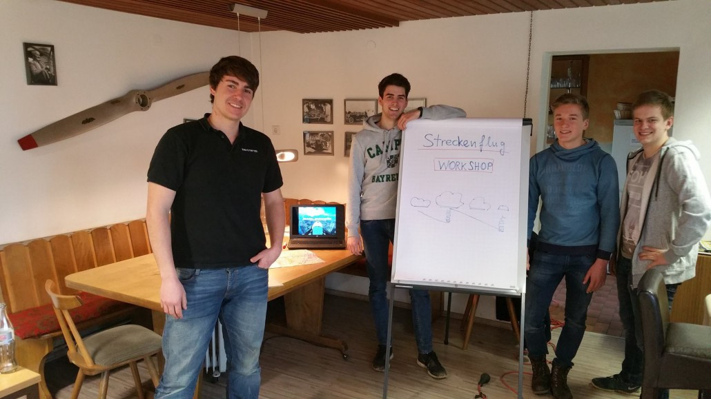
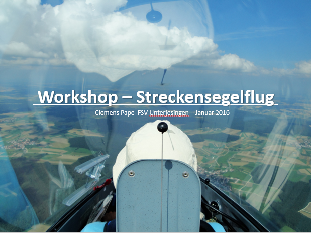
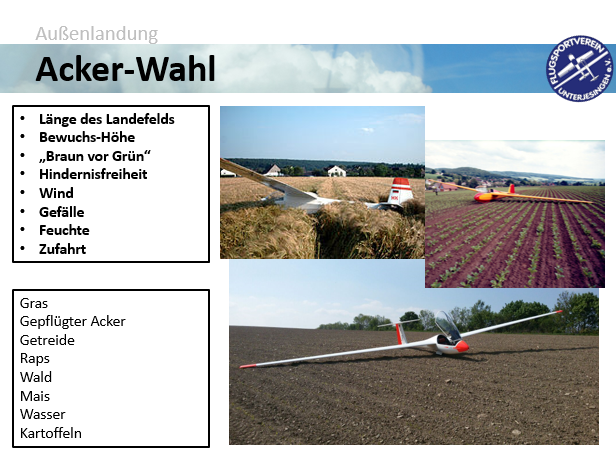

Streckenfliegen, aber Wie?

Vom Scheinerhalt und den ersten Versuchen vom Heimatflugplatz wegzufliegen, bis hin zum großen Streckenflug, ist es für Neulinge im Überlandflug ein langer Weg, der vom ständigen „Try and Error“ geprägt ist.

Am Freitag und Samstag lud Clemens deshalb zum Streckenflug-Workshop im Vereinsheim ein, um unsere jungen Scheinpiloten für die kommende Saison vorzubereiten.

Dabei wurden unter Anderem Fragen rund um das Außenlanden, den richtigen Umgang mit Stresssituationen, das effektive Anfliegen von Aufwinden und den effizienten Gleitflug besprochen.

Jetzt gilt es, das Erlernte ab März umzusetzen!
