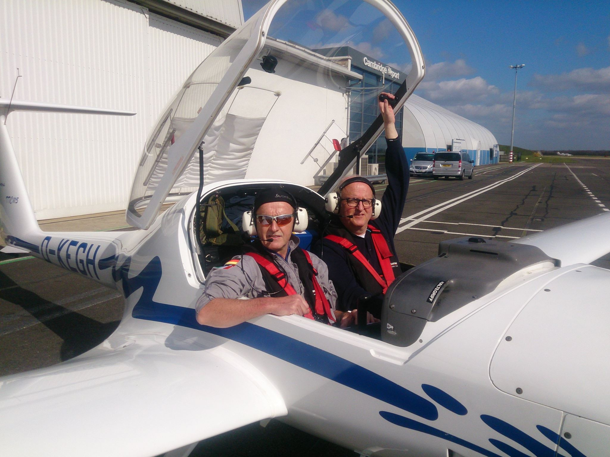
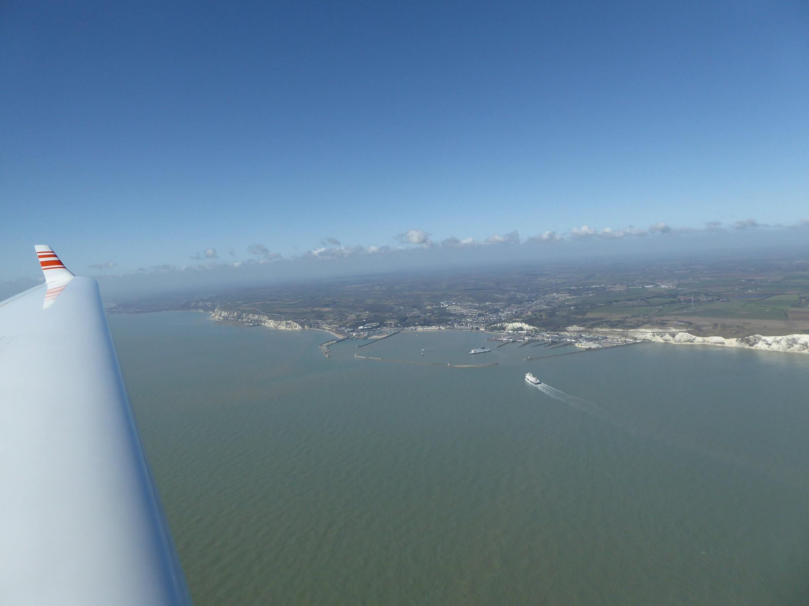
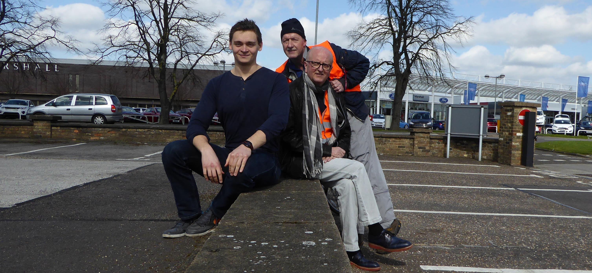

Über Ostern waren Axel Baudermann und Ulrich Wild **mit unserem Motorsegler (MoSe) zu Besuch bei Nathanael West in Cambridge**.

Die Planungsvorbereitungen und das Routing für den Flug über den Ärmelkanal auf die „Insel“ waren ziemlich anspruchsvoll, zumal die Lufträume im United Kingdom zum Teil bis auf 2.500 Fuß über dem Meeresspiegel herunter führen. Das sind gerade einmal 800 Meter.

Die Reise führte die beiden Piloten des FSV Unterjesingen von Poltringen über Belgien, Luxemburg, und Frankreich bevor sie die „Strait of Dover“ zwischen Cap Cris Nez und Dover querten. Die weitere Strecke führte zwischen den Lufträumen von London und Soutend im Zickzack bis nach Cambridge. In ständiger Absprache mit den Fluglotsen der englischen Flugsicherung bedeutete das sehr viel Arbeit für Axel und Uli.

Die Flugplanung mussten die Beiden aufgrund der sich ständig ändernden Wetterlage häufig anpassen und flexibel einteilen. Wegen einer nahenden Schlechtwetterfront entschieden sie sich für einen baldigen Rückflug.

Nach Zwischenlandungn in Le Touquet, Valenciennes, Sedan Douzy und Trier ging es dann zurück nach Poltringen.

Für unsere Piloten war dies sicherlich ein unvergessliches Erlebnis!

