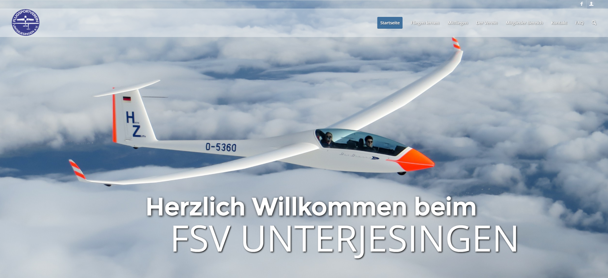
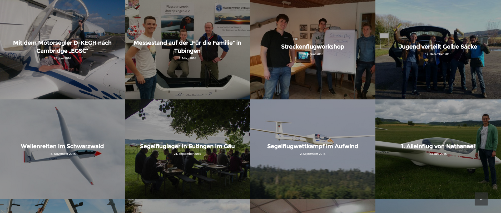
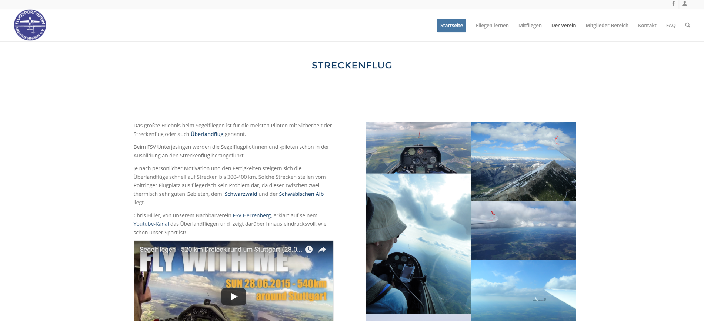

Nun ist es endlich soweit! Der FSV Unterjesingen hat eine neue Homepage.

Das alte Design der Seite war nach einiger Zeit wirklich in die Jahre gekommen und es wurde allerhöchste Zeit hier etwas zu tun!

## Ein kleiner Überblick einiger Neuerungen unserer Homepage:

Mit dem Umstieg auf eine WordPress gemanagte Seite ist die Seite „responsive“, das heißt, die Homepage passt sich je nach verwendetem Gerät (PC, iPad, Smartphone) an und das Layout verändert sich, damit größtmöglicher Komfort für den Benutzer gewährleistet werden kann.

Die Website versucht mit vielen emotionalen Bildern, Videos, interessanten Texten über das Fliegen, aktuellen News des FSV Unterjesingen und vielem mehr, jung und alt für unser einzigartiges Hobby Segelfliegen zu faszinieren. Die Menü-Struktur unserer Website wurde im Zuge der Neugestaltung grundlegend überarbeitet und soll für Interessierte einfach und logisch sein. Trotzdem birgt die Homepage beim genauen Hinschauen eine große Tiefe und viel Information für (zukünftige) (Segelflug)Pilotinnen und Piloten. Vor allem die Rubrik [Segelfliegen](https://www.fsv-unterjesingen.de/portfolio-item/segelflug/) soll in Zukunft weiter ausgebaut werden.

Die Seite „[Mitfliegen](https://www.fsv-unterjesingen.de/startseite/mitfliegen/)“ wurde deutlich zentraler platziert, um Flug-Enthusiasten direkt zu einem Schnupperflug zu animieren und für die einzigartige Freizeitbeschäftigung Fliegen zu gewinnen. Ein Video soll Eindrücke aus der Luft direkt vermitteln und Vorfreude auf einen Flug bereiten (siehe auf der Seite „[Leistungssport](https://www.fsv-unterjesingen.de/startseite/der-verein/leistungssport/)“ zum Thema Streckenflug).

Darüber hinaus wurde das wichtige Thema „[Fliegen lernen](https://www.fsv-unterjesingen.de/startseite/fliegen-lernen-2/)“ inhaltlich ausgebaut und soll auf unsere Ausbildungs-Pauschale für 300 € aufmerksam machen (eine detaillierte Übersicht über dieses Angebot wird noch erstellt und auf der Seite implementiert).

Wichtige Elemente aus der alten Homepage wurden natürlich übernommen. Nach wie vor gibt es einen Überblick über unseren [Flugzeugpark](https://www.fsv-unterjesingen.de/startseite/der-verein/flugzeugpark/), die interessante Historie unseres Vereins in der [Chronik](https://www.fsv-unterjesingen.de/startseite/der-verein/chronik/), sowie die aktuellen Bilder des Flugplatzes aus der [Webcam](https://www.fsv-unterjesingen.de/startseite/der-verein/webcam/).  
Häufig gestellte Fragen, sogenannte [FAQ](https://www.fsv-unterjesingen.de/startseite/faq/) (frequently asked questions) sind prominent auf erster Ebene des Menüs zu finden. Dies soll Neulingen möglichst schnell einen kompakten Überblick schaffen.

### Für Vereins-Interne:

Der Mitglieder-Bereich ist auf Vereinsflieger verschoben worden.  
Den Link hierzu findet ihr ganz unten auf der Homepage 

Neben diesen Neuerungen gibt es noch zahlreich weitere, allerdings würde es den Rahmen sprengen diese alle aufzulisten.

Wir wünschen euch viel Spaß beim Stöbern durch die neue Seite.

Bestimmt haben sich ein paar Fehler eingeschlichen.  
Unser Webseite-Ersteller Clemens freut sich über eure Rückmeldung und Verbesserungsvorschläge.

Das Kontaktformular bereitet zur Zeit noch etwas Probleme, deshalb bitte Mails [direkt an Clemens schreiben](mailto:clemens.cp@googlemail.com) (hierfür einfach auf den Link klicken)
