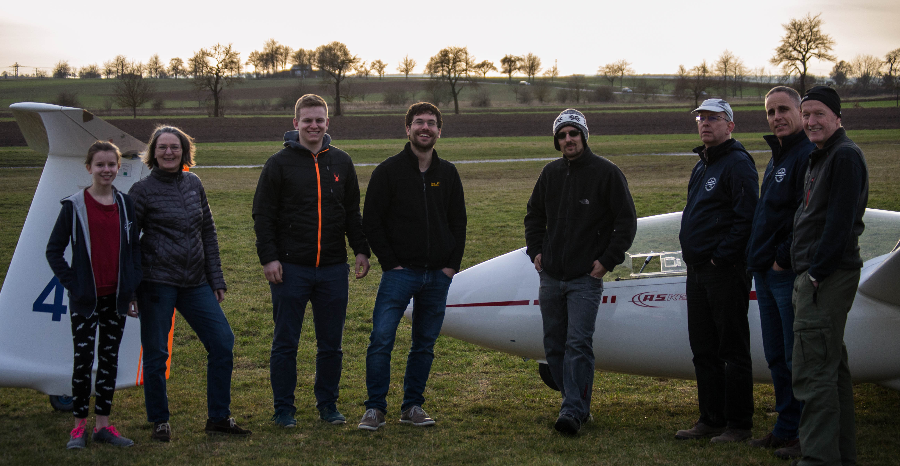
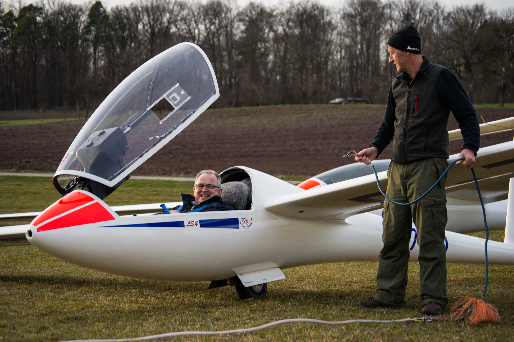
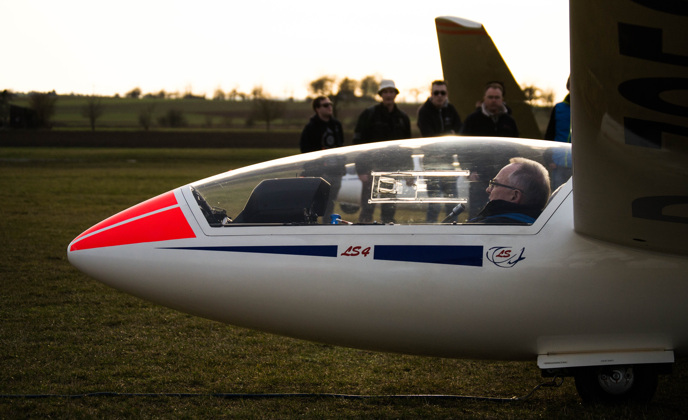
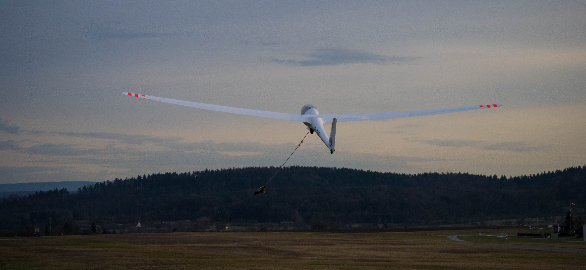
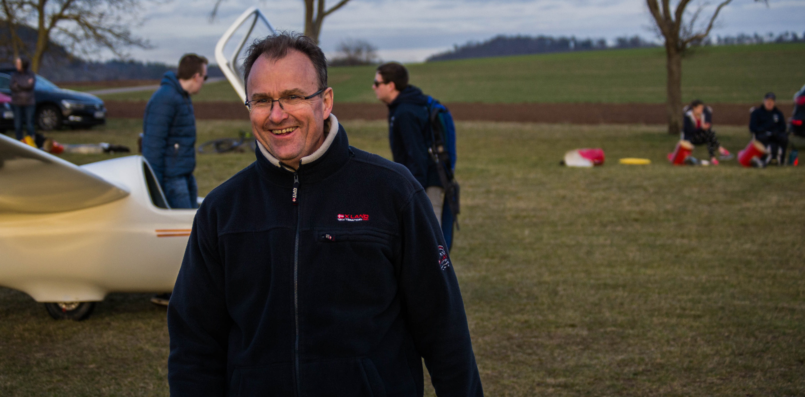
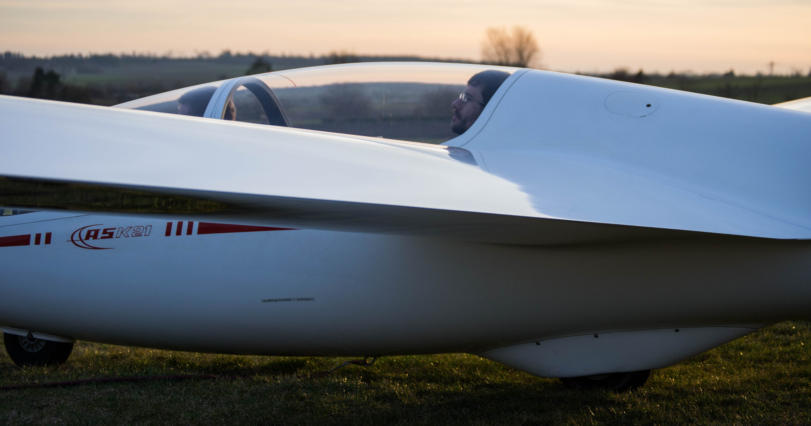
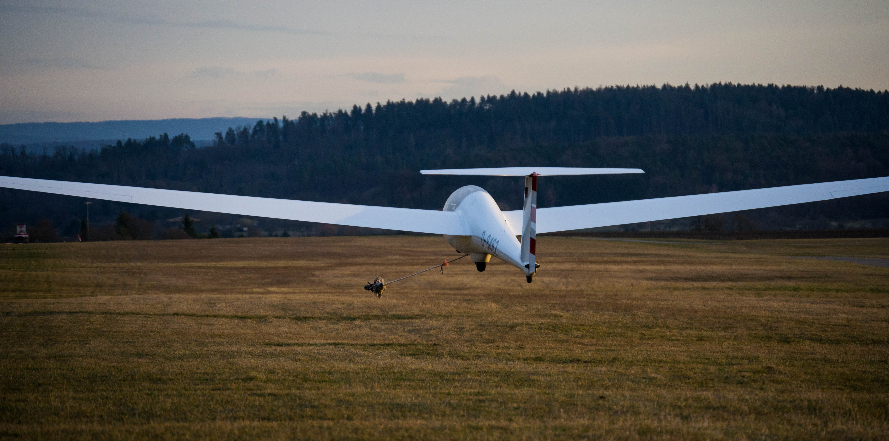
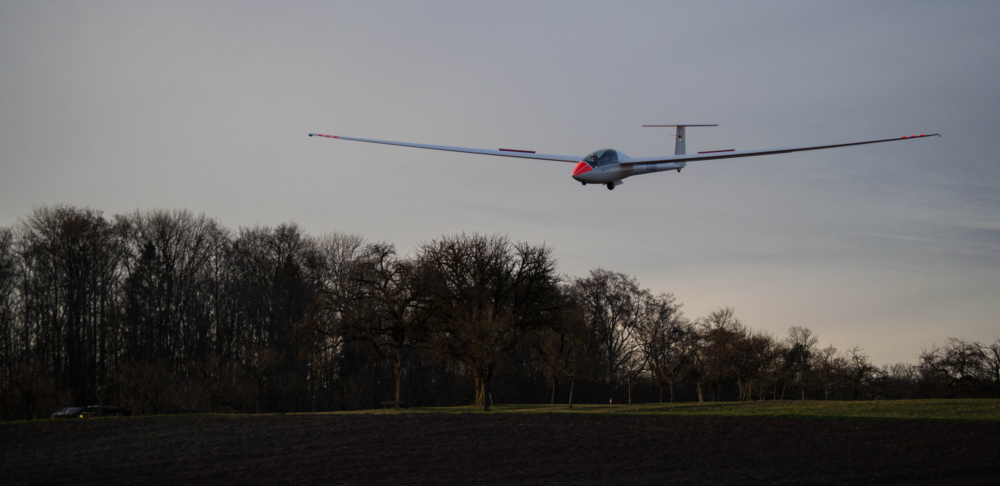

Am vergangenen Wochenende ist der FSV Unterjesingen auf dem Flugplatz in Poltringen erfolgreich in die neue Saison gestartet. Bei traumhaften Bedingungen konnten die ersten Flüge gemacht werden. Im Winter wurden die Segelflugzeuge gründlich geprüft und für die Saison fit gemacht – die alljährliche Jahresnachprüfung wurde mit Bravour bestanden.

Wir freuen uns über jeden Besuch auf unserem Flugplatz in Poltringen! Das neu Flugplatzrestaurant und ein toller Kinderspielplatz bieten beste Möglichkeiten für einen Familien-Wochenend-Ausflug. Gäste begrüßt ein herrlicher Ausblick auf die Schwäbische Alb und den Schönbuch und ein spannendes Flugplatzgeschehen. Der große Parkplatz bietet ausreichend Platz für Besucher. Schnupperfluganfragen nehmen wir gerne entgegen.

  

  

