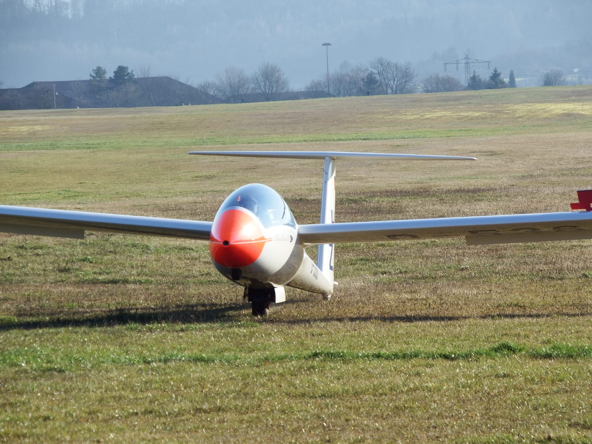
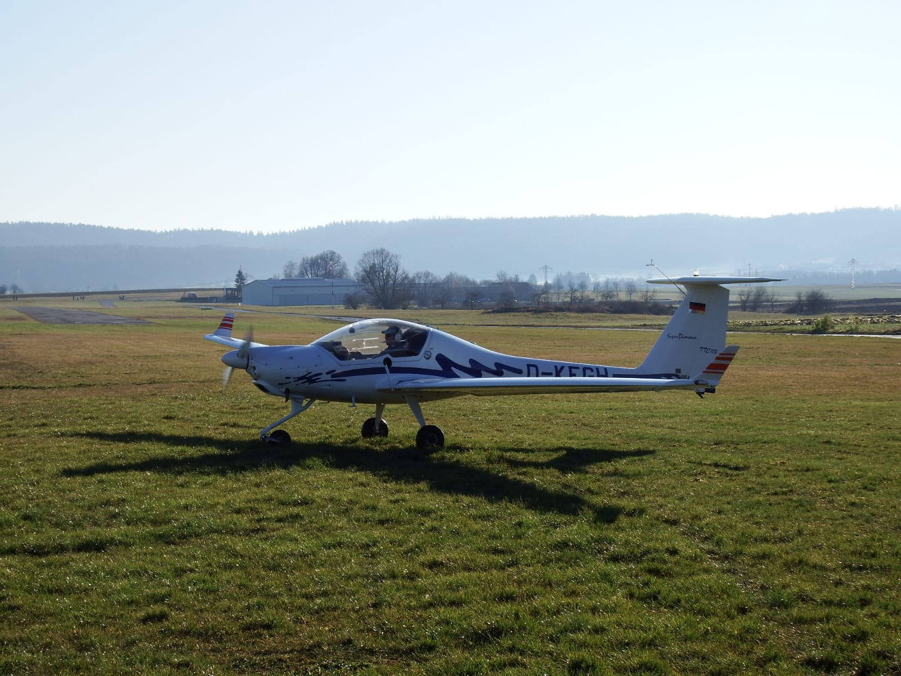
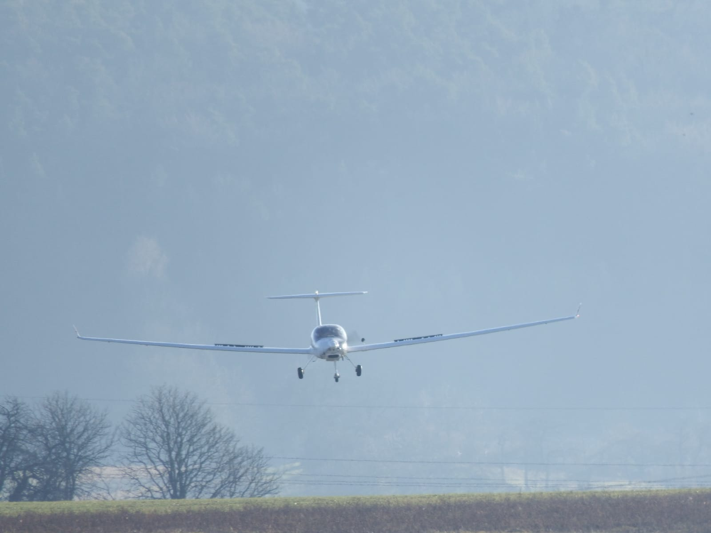
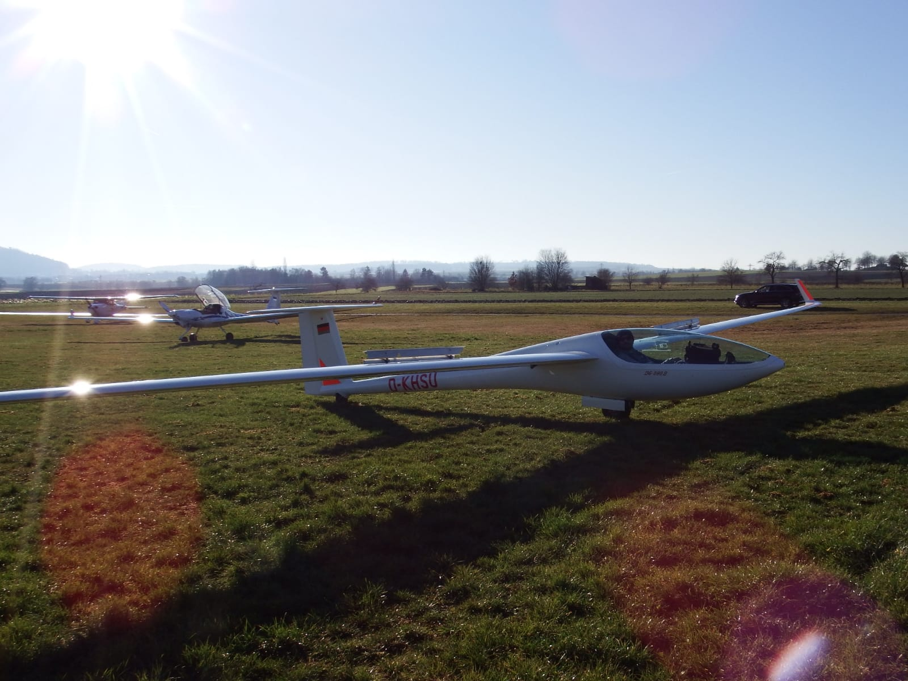
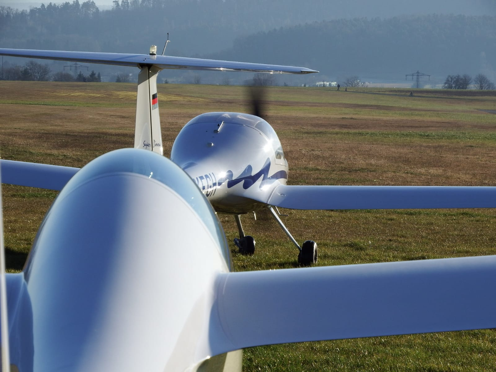
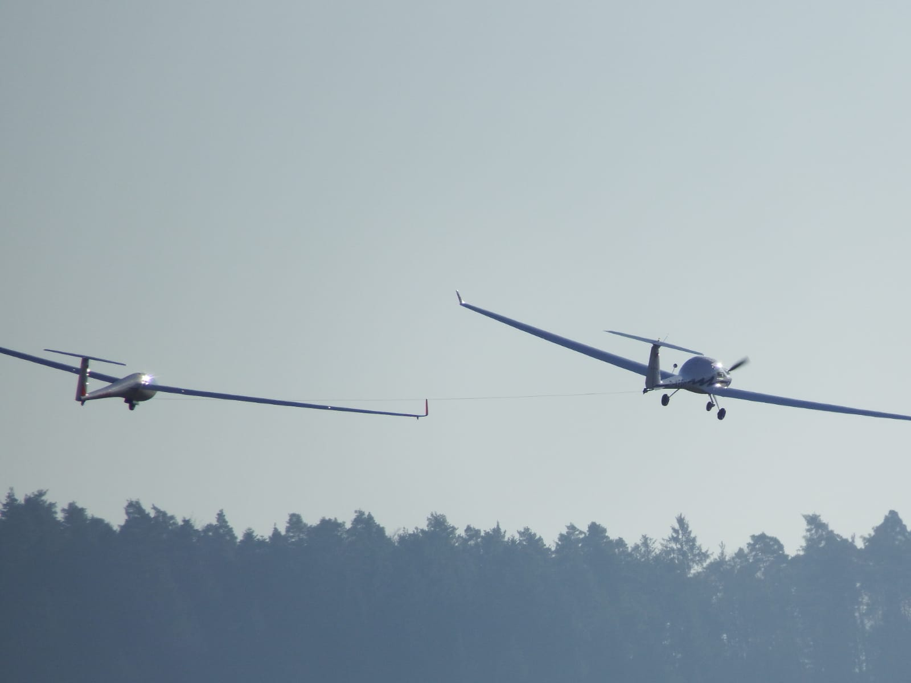

Am Montag, den 06. Januar haben einige Mitglieder des Flugsportverein Unterjesingen die Flugsaison 2020 vorzeitig eröffnet.

Bei herrlichem Wetter und Temperaturen etwas über 0°C wurden die ersten F-Schlepps mit unserem [DuoDiscus](https://www.fsv-unterjesingen.de/startseite/der-verein/flugzeugpark/duo-discus/) und der Super Dimona durchgeführt. Auch unsere [DG808](_wp_link_placeholder), welche nach einer Motorwartung beim Hersteller wieder zurück ist, wurde für einige Eigenstarts ausgeräumt, sodass jeder Pilot fliegen konnte und wir bereits einige Flüge absolvieren konnten, um die „lange“ Winterpause etwas kürzer zu gestalten, bevor es dann ab März wieder mit dem regulären Flugbetrieb in Poltringen losgehen kann.

Nun geht die Wartung unserer Flugzeuge in Unterjesingen weiter und wir freuen bereits jetzt auf viele schöne und lange Flüge im Jahr 2020!

