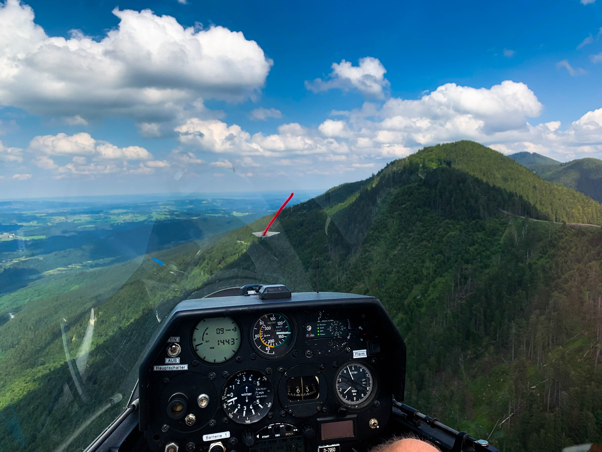
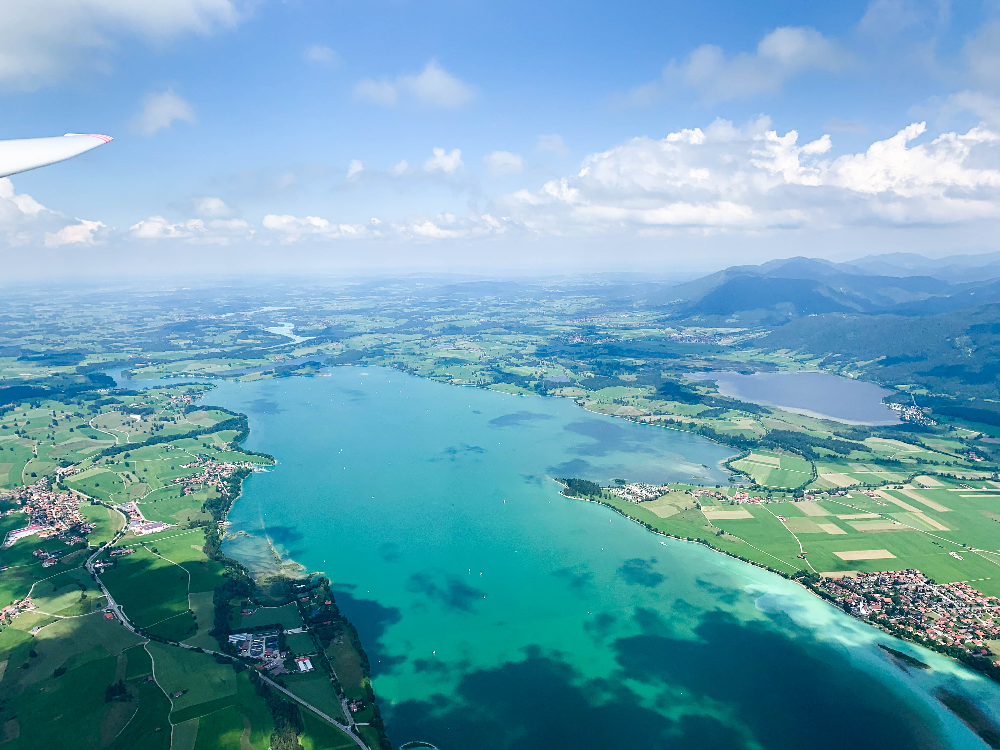
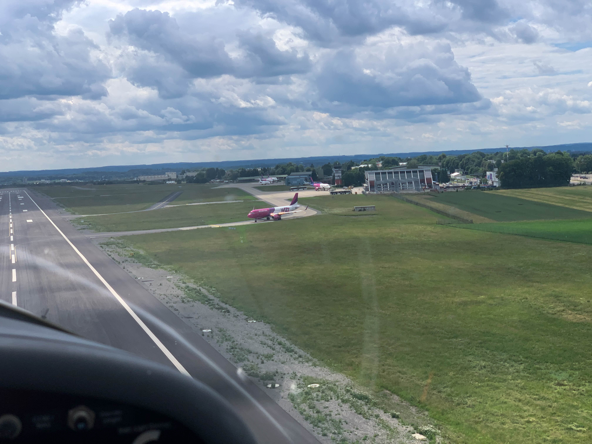
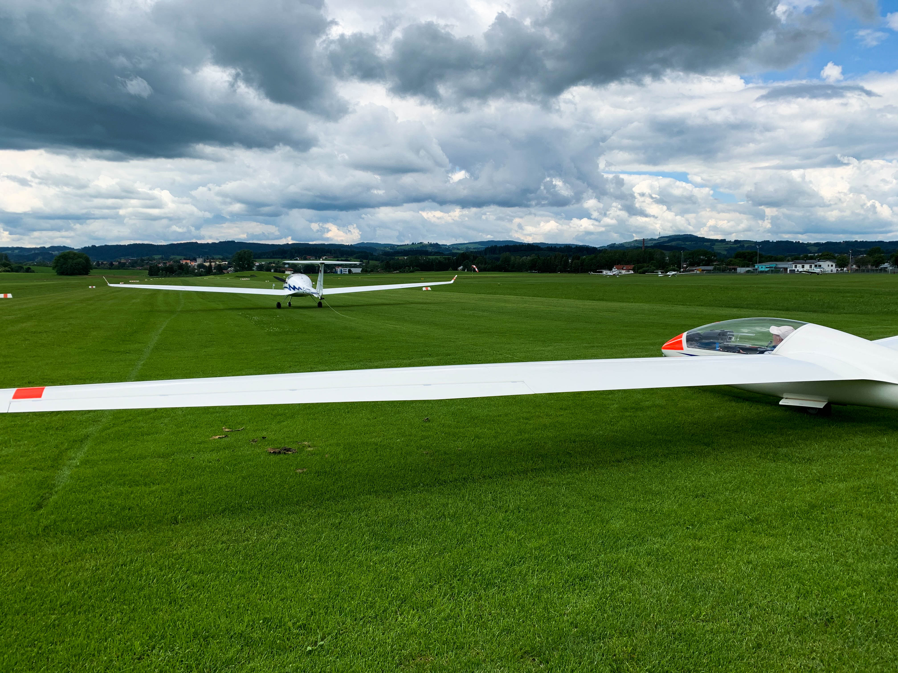

Seit mehr als 20 Jahren fahren einige Flugbegeisterte Mitglieder des FSU jedes Jahr für eine Woche nach Kempten, um vom Flugplatz Kempten-Durach (EDMK) aus zu Streckenflügen in den Alpen oder dem Alpenvorland aufzubrechen.

Trotz Corona konnte das Fluglager auch dieses Jahr stattfinden, auch wenn es mehr Planung als zuvor erforderte.

Gut organisiert brach die Kolonne mit drei unserer Segelflugzeuge (DuoDiscus, DG808, LS4b) am Morgen des 20.Juni in Richtung Allgäu auf. Auch unser Motorsegler stieß im Laufe des Vormittags dazu und ermöglichte bereits erste Flüge am Mittag. Erste größere Thermikflüge konnten am Montag unternommen werden. Die Wetterlage hielt noch bis Donnerstag an, was die Piloten ausnutzten, sodass dieses Jahr mehr als 60 Stunden geflogen wurde. So kam jeder der 16 Teilnehmer im Alter zwischen 18 und 83 Jahren auf seine kosten.

Zu den Highlights des Fluglagers zählten unter anderem ein Flug zum Flughafen Memmingen, mehrere Streckenflüge mit Distanzen von mehreren hunderten Kilometern Strecke sowie ein Besuch im Bayrischen Eggenfelden.

Das Fluglager war wieder ein großer Erfolg.

Der Flugsportverein Unterjesingen bedankt sich recht herzlich bei der Flugplatzgesellschaft Kempten für die Gastfreundschaft und freut sich schon auf das nächste Fluglager in Kempten!

