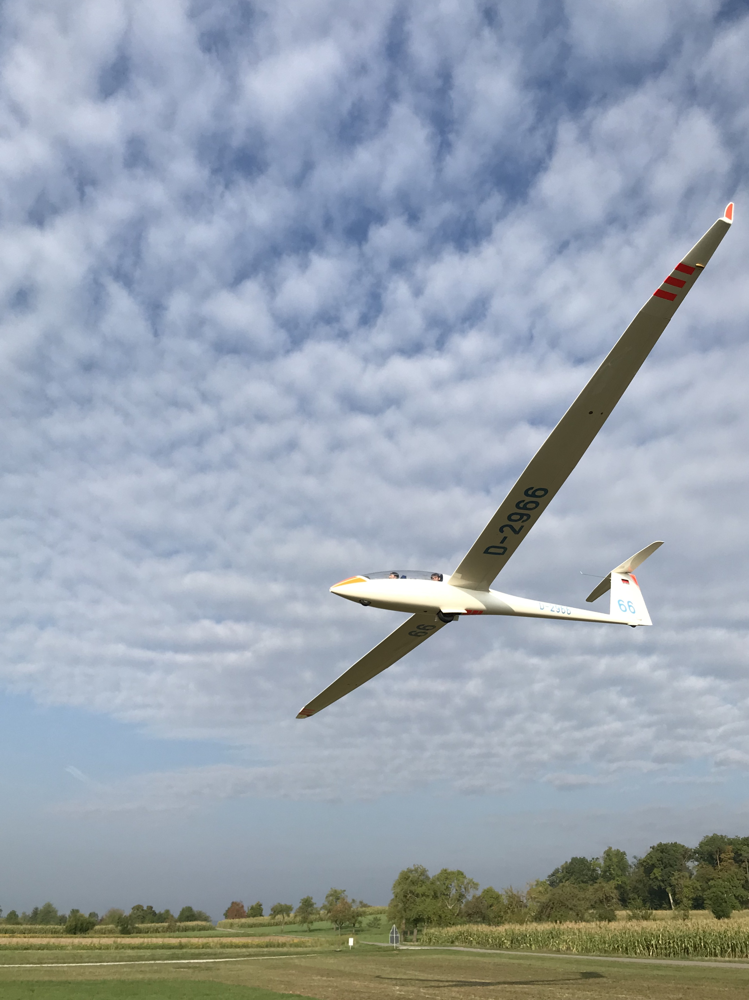
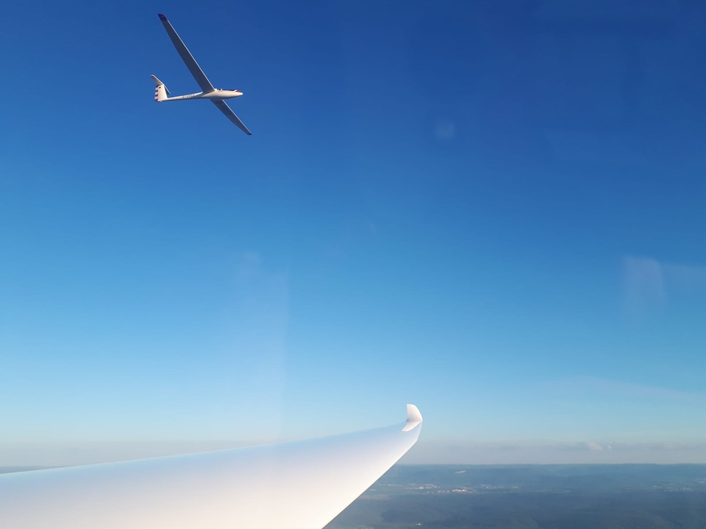
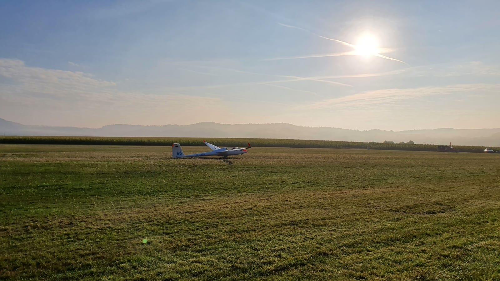
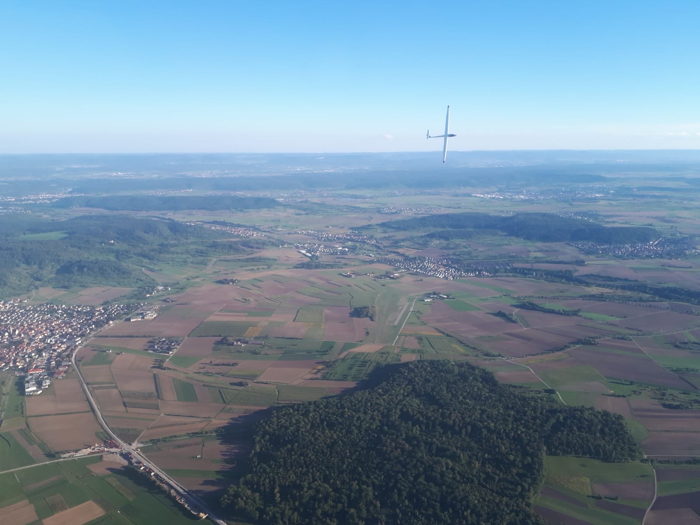
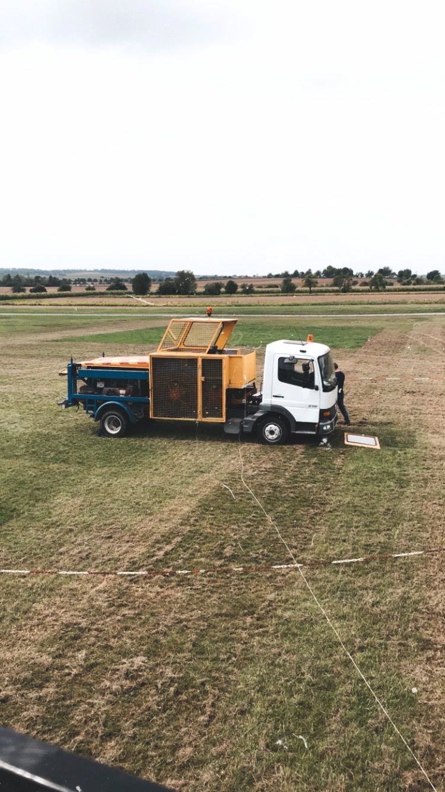

In der letzten Sommerferienwoche haben wir gemeinsam mit unserem Nachbarverein (FSV Herrenberg) eine Woche Flugbetrieb für Flugschüler und Piloten jeglicher Altersklasse organisiert als Möglichkeit die fliegerischen Lücken der Coronapause zu füllen.

Normalerweise veranstaltet unser Verein und der FSV Herrenberg in Kooperation mit 2 anderen Flugplätzen in dieser Woche ein Schulungslager für Flugschüler und Jungscheininhaber: das THURM+B – Lager. Dies musste dieses Jahr coronabedingt leider ausfallen.

Die Woche war ein voller Erfolg! Das Wetter hat super mitgespielt und somit konnten wir einige Stunden zusammen fliegen. Dementsprechend war die Stimmung gut, alle haben mitgeholfen und unsere Flugschüler sind in ihrer Ausbildung ein deutliches Stück vorangekommen. Auch die Scheininhaber haben von langen, schönen Flügen sehr profitiert.

Am letzten Tag wollten wir ein Sunrise-Fliegen veranstalten. Als wir ausgehallt hatten, hat uns leider eine dichte Nebelbank quer über dem Platz einen Strich durch die Rechnung gemacht. Dann hieß es warten. Der erste Flieger startete erst gegen 8:00 Uhr, es hat sich aber trotzdem gelohnt die Flieger so früh auszuhallen. Der restliche Tag wurde natürlich auch noch fleißig genutzt um Starts zu sammeln.

Herzlichen Dank an alle Teilnehmer, Windenfahrer, Flugleiter, Fluglehrer und dem FSVH für die tolle Zusammenarbeit und eine gelungene Woche Flugbetrieb!

