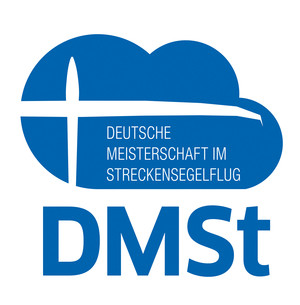
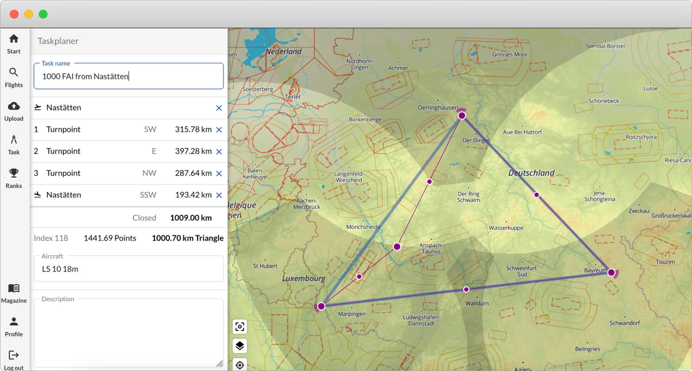
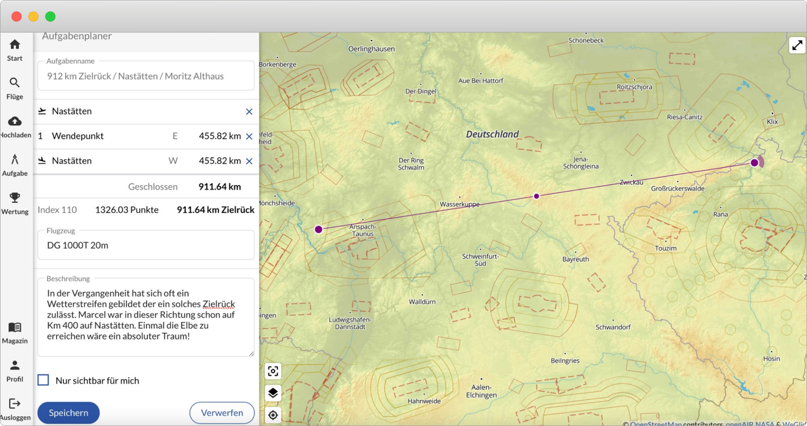
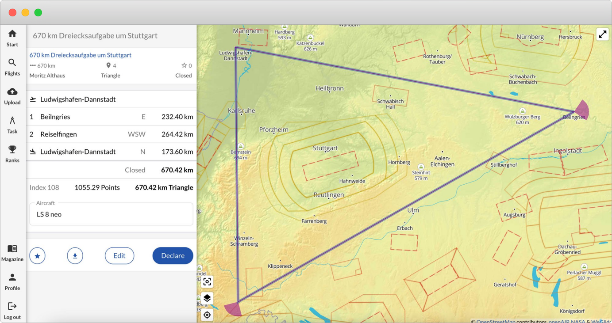
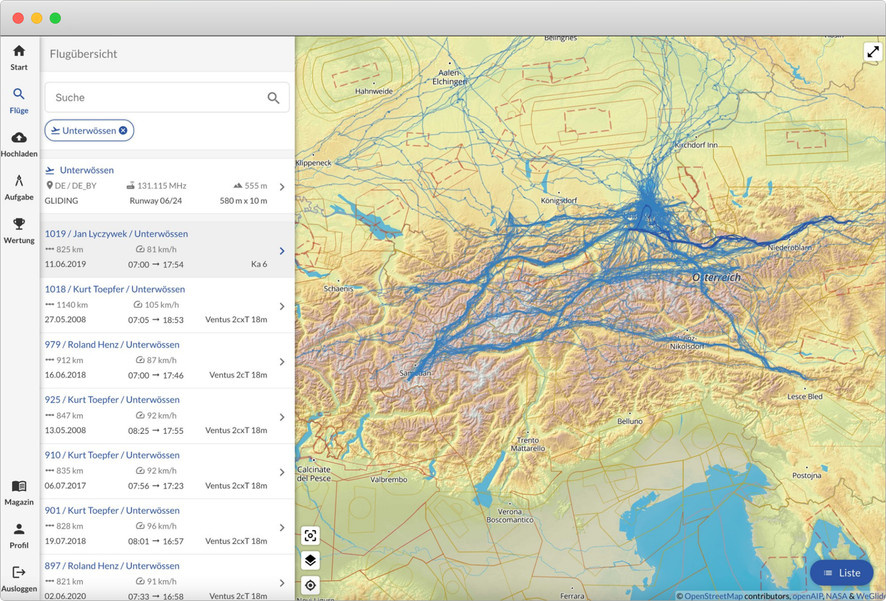
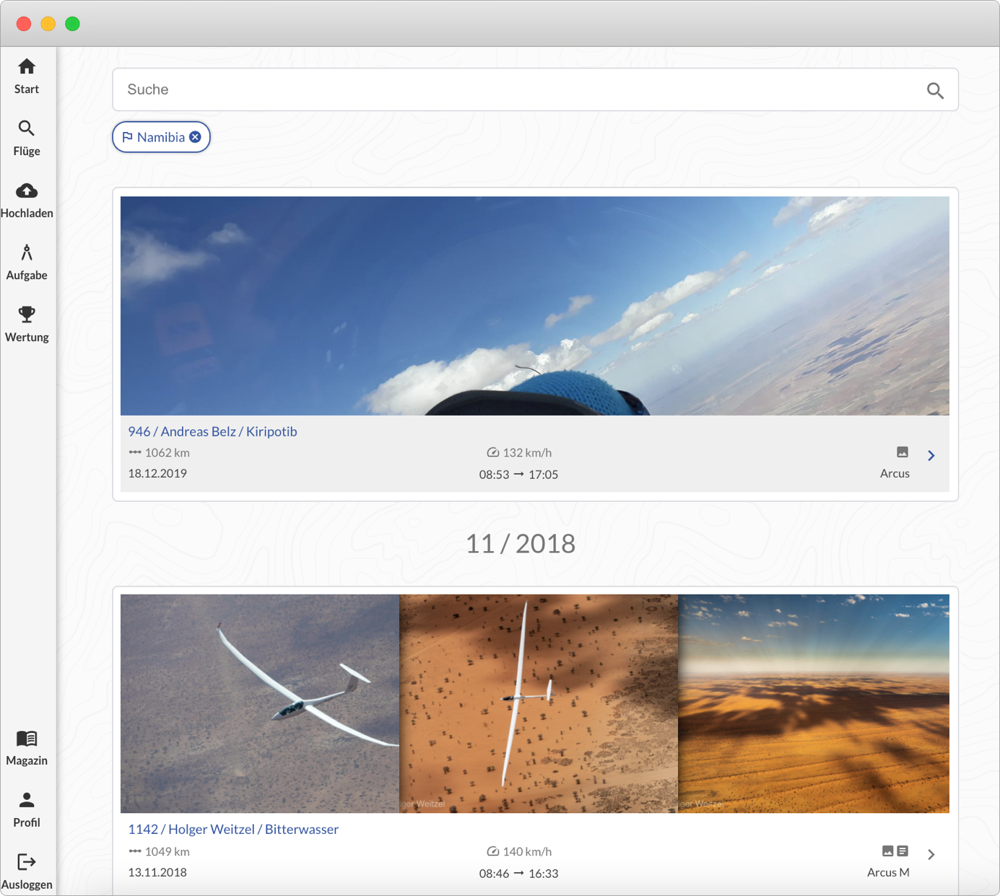
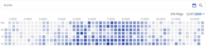
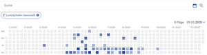



# DEUTSCHE MEISTERSCHAFT IM STRECKENSEGELFLUG (DMST)

Quelle: <https://www.daec.de/sportarten/segelflug/sport/streckenflug/dmst/>

Die Deutsche Meisterschaft im Streckensegelflug (DMSt) ist der dezentrale Breitensportwettbewerb der Bundeskommission Segelflug, welcher jährlich üblicherweise von März bis September ausgetragen wird. In diesem Jahr startet die DMSt aufgfrund der Corona-Pandemie im Mai.

Die Sieger\*innen der DMSt des jeweiligen Austragungsjahres werden am nachfolgenden Deutschen Segelfliegertag geehrt. Beginnend mit der Saison 2021 wird der Wettbewerb online über das Portal WeGlide ausgerichtet.

Unter [weglide.org](https://www.weglide.org/) können Aufgaben deklariert, Flüge hochgeladen und aktuelle Wertungen eingesehen werden. Für Fragen und Anregungen zum Wettbewerb sowie bei Problemen mit dem Meldeportal steht die Kontaktadresse <support@weglide.org> zur Verfügung.

Mit der Wettbewerbsordnung befasst sich der Fachausschuss Breitensport jeweils auf seiner Frühjahrs- und Herbstsitzung. Mit dem Wechsel zu WeGlide wurde die Wettbewerbsordnung umfassend überarbeitet.

Die aktuellen Regeln hat die Bundeskommission Segelflug in der [DMSt-Wettbewerbsordnung 2021](https://www.daec.de/fileadmin/user_upload/files/2021/Sportarten/Segelflug/DMSt-WO_2021_Final.pdf) bekannt gegeben und zusätzlich die [DMSt-Indexliste](https://www.daec.de/fileadmin/user_upload/files/2021/Sportarten/Segelflug/DMSt-WO_2021_Index.pdf) veröffentlicht.

Von 2003 bis 2020 wurde der Wettbewerb online über das Portal der SegelflugszenegGmbH (OLC) abgebildet. Frühere Wertungen sind über [onlinecontest.org](https://www.onlinecontest.org/) weiterhin verfügbar.

# NEUERUNGEN DER DMST

Die DMSt startet in diesem Jahr am 1. April 2021 und wird künftig von WeGlide ausgewertet. Diese Chance nutzt die Bundeskommission Segelflug, einige Neuerungen einzuführen. Großen Mehrwert für Pilot\*innen verspricht dabei die Online-Deklaration. Diese ergänzt die Möglichkeit, Aufgaben weiterhin im Logger zu deklarieren.

#  AUFGABENPLANER

Pilot\*innen können Aufgaben selber planen, bestehende Aufgaben hochladen oder Aufgaben anderer Pilot\*innen auswählen. Mit einem Klick werden diese vor Flugbeginn deklariert. Dies lässt sich auch kurz vor dem Start mit dem Handy erledigen.

Viel debattiert wurde darüber, was ‘flächiges Fliegen’ bedeute. Am Ende wurde sich darauf verständigt, auch freie und angemeldete Ziel-Rückkehr-Flüge zur Wertung hinzuzufügen und diese mit einem Bonus von 30% respektive 60% zu versehen.  
  
Wer sich also weit von seinem Flugplatz entfernt und unterschiedlichste Wetterräume durchquert, hat in Zukunft die Chance, sich vorne in den Ranglisten wiederzufinden.

Der bisherige Bonus für angemeldete Flüge von 30% wird beibehalten. Für Dreieck und Viereck gibt es wie bisher einen zusätzlichen Bonus von 40%.  
  
Auch angemeldete Mehrfach-Umrundungen von Drei- und Vierecken sind wieder möglich und werden zusätzlich zum Anmeldebonus mit einem Bonus von 20% bewertet.

Die DMSt 2021 wird erstmals neben der Streckenwertung auch eine Geschwindigkeitswertung beinhalten. Über einen Zeitraum von 2 Stunden werden die schnellsten 3 Schenkel gewertet.  
  
Dabei ist es unerheblich, ob die Landung auf dem Startplatz erfolgt oder nicht. Die Wendepunkte der Geschwindigkeitswertung müssen zudem nicht den Wendepunkten der Streckenwertung entsprechen, sondern werden eigens optimiert.  

# FRAUEN UND JUNIOR\*INNEN

Sowohl in der Frauen-, als auch in der Juniorenwertung gibt es ab dieser Saison nur noch eine klassenübergreifende Rangliste. Die Zusammenlegung der verschiedenen Klassen soll eine bessere Vergleichbarkeit ermöglichen.  
  
Gerade im Juniorenbereich zeigte sich in der Vergangenheit, dass oft mit verschiedenen Flugzeugtypen geflogen wurde, was es schwierig machte, drei Flüge in einer Klasse zusammenzubekommen. Zudem gehen Flüge im Doppelsitzer mit zwei Junior\*innen bzw. zwei Frauen zukünftig auch in die Junioren- bzw. Frauenwertung ein.  

# DMST-BUNDESLIGA

Mit der DMSt-Bundesliga, die die bisherige Vereinswertung ersetzt, wird von der Bundeskommission Segelflug eine Wochenend-Wertung für Vereine geschaffen, in die sowohl Strecken- als auch Geschwindigkeitspunkte eingehen. Ziel ist, die unterschiedlichen fliegerischen Schwerpunkte der Pilot\*innen eines Vereins in einer Wertung zusammenzuführen.  
  
Diese Wochenend-Wertung setzt sich zusammen aus den 3 schnellsten Flügen eines Vereins und den 3 punkthöchsten DMSt-Flügen des Vereins. Die DMSt-Punkte gehen mit einem Faktor von 10% in die Wertung ein. Dabei können Flüge sowohl für die Geschwindigkeits- als auch für die Streckenwertung herangezogen werden. In den kommenden Wochen wird es dazu weitere Infos geben.  
  
In 2021 wird an 17 Wochenenden vom 01./02.05.21 bis zum 21./22.08.21 eine Vereinsliga (inkl. Deutscher Meisterschaft) erfolgen.  
  
Ab der Saison 2022 ist ein grundsätzlich neues Liga-Konzept geplant, in dem Vereine in Gruppen ‚gegeneinander‘ antreten. Die Bundeskommission Segelflug freut sich, nun eine attraktive Vereinswertung als Teil der Deutschen Meisterschaft zu bieten und hofft, dass dieses Konzept den Vereinen auch in der Öffentlichkeitsarbeit neue Möglichkeiten gibt.  
 

# SUCH- UND FILTERMÖGLICHKEITEN

Es ist schön zu sehen, wie sich die Plattform allmählich mit Leben füllt. Zahlreiche Flüge wurden beispielsweise aus den Alpen hochgeladen. Wird ein solcher Filter in der Liste eingegeben und die Liste nach unten gescrollt, so werden bis zu 2000 Flüge gleichzeitig auf die Karte geladen.

Dabei kann nicht nur nach Flugplätzen, sondern auch nach Vereinen, Regionen, Ländern oder Flugzeugen gesucht werden. Filter können zudem beliebig kombiniert werden.

# GESCHICHTEN

Seit dem Jahreswechsel wurden von mehr als 1.000 Pilot\*innen bereits über 10.000 Flüge hochgeladen. Viele von ihnen haben Bilder zu ihren Flügen hinzugefügt und lassen WeGlide so zu einer lebendigen Plattform heranwachsen.  
  
Wir haben zudem eine Suchfunktion hinzugefügt, mit der sich die Geschichten nach Orten und Regionen durchsuchen lassen.

# DATUMSFILTER

Nachdem wir viel Feedback aus der Community bekommen haben, haben wir unseren Datumsfilter grundsätzlich überarbeitet. Wird das Kalendersymbol ausgewählt, so öffnet sich ein Graph, der alle Tage eines Jahres darstellt.

  
  
Die Farbe der Kästchen veranschaulicht dabei die Anzahl der hochgeladenen Flüge des jeweiligen Tages. Die genaue Anzahl wird im oberen Bereich angezeigt, sobald die Maus auf einen bestimmten Tag im Kalender bewegt wird. Wählt man ein Datum aus, so wird dieses als Filter gesetzt.  
  
Werden Filter aus der Suchleiste ausgewählt, so passt sich der Datumsgraph dynamisch an. Durch eine solche Visualisierung ist es möglich, individuelle Trends wie den Beginn der Flugsaison in einer bestimmten Region zu erkennen.

  
  
Die Bundeskommission Segelflug und WeGlide freuen sich darauf, in den kommenden Wochen weitere Features öffentlich machen zu können.
