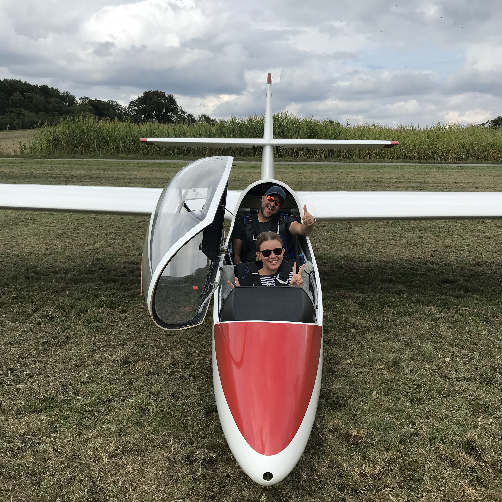
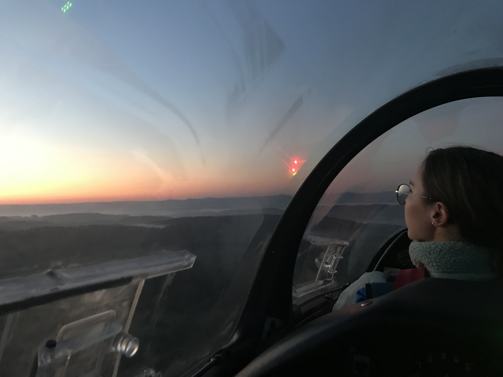
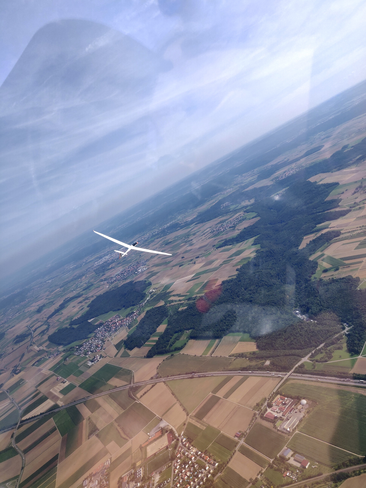
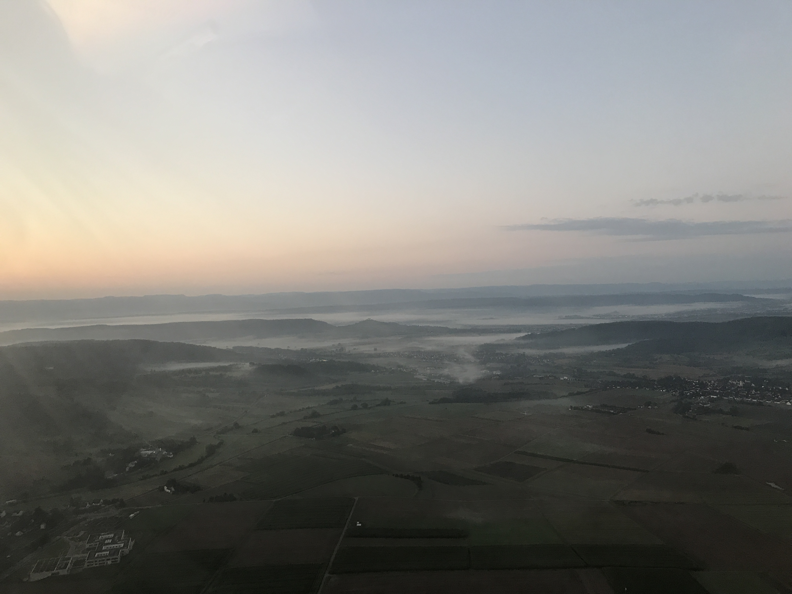
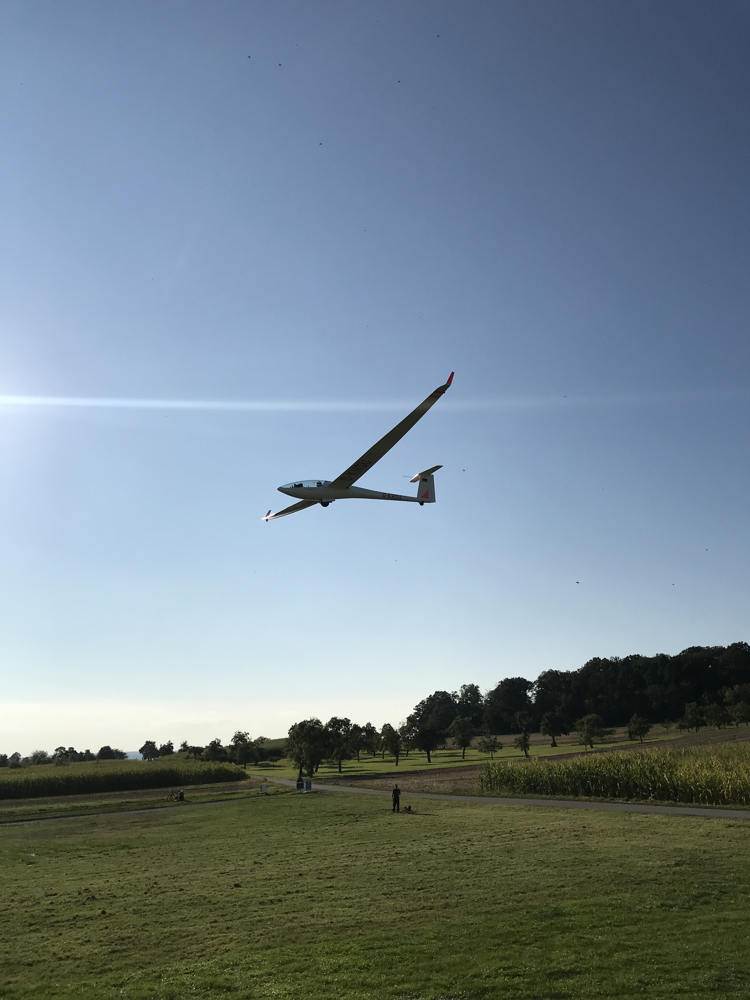

Endlich war es soweit!

Das normalerweise jährlich stattfindende THURM-Lager zu Schulungs- und Ausbildungszwecken mit den Vereinen LSG Hanns-Klemm, FSV Mössingen und FSV Herrenberg, konnte nach einem Jahr Coronapause wieder starten. Rotierend zwischen den Flugplätzen Farrenberg, Eutingen und Poltringen, hatten wir gemeinsam mit dem FSV Herrenberg die Ehre Gastgeber zu sein.

Mit insgesamt 4 teilnehmenden Schulungsdoppelsitzern und einigen Einsitzern konnten wir alle ordentlich Starts und Flugstunden sammeln und uns fliegerisch weiterentwickeln. Vor allem da das Wetter die gesamte Woche einwandfrei mitgespielt hat und wir mit warmen Temperaturen und Sonne gesegnet waren.

Neben dem Fliegen kam die Gemeinschaft ebenfalls nicht zur kurz nach einer solch langen Durststrecke an sozialen Kontakten. Ob beim Abendessen, am Lagerfeuer oder während des Flugbetriebs, es war immer etwas los und alle hatten ihren Spaß.

Ein Highlight der Woche war das traditionelle Sunrisefliegen. Montagmorgen um 5 Uhr sind alle aus ihren Betten gekrochen um die Hallentore aufzuschieben und die Flieger rauszuholen, belohnt wurden wir dann aber mit atemberaubenden Aussichten vom Sonnenaufgang in 300m über Grund.

Schlussendlich war es mal wieder ein ausgezeichnetes THURM-Lager mit wunderbaren Erlebnissen. Vielen Dank an alle, die das möglich gemacht haben!

