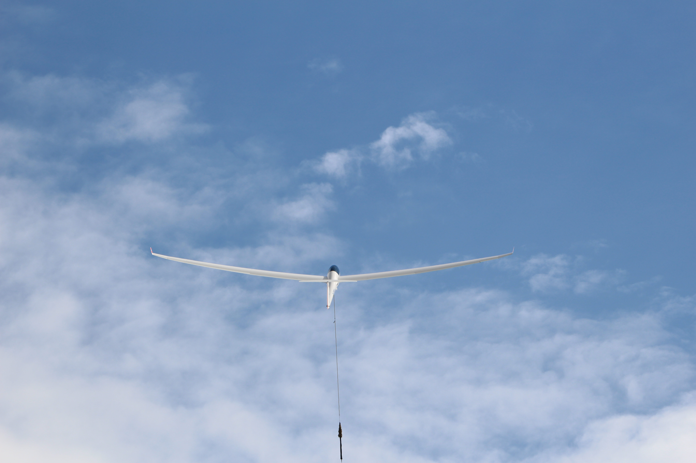

# (Gast-) SegelfluglehrerIn gesucht

  
Zur Unterstützung und Gewährleistung einer weiterhin guten Segelflugausbildung suchen wir, der FSV Unterjesingen e.V., eine/n (Gast-) SegelfluglehrerIn.

Du hast …

- … eine FI(S)-Berechtigung
- … Lust Flugschülern das Fliegen beizubringen
- … Lust auch selber zu fliegen

Wir bieten …

- … einen guten Flugzeugpark (ASK21, ASK23, LS4, LS4b, DuoDiscusXL, DG808b, Ventus 3M) zu moderaten Flugpreisen
- … keine zu zahlenden Werkstattstunden für FI(S)
- … kein Aufnahmebeitrag für FI(S)
- … SPL oder LAPL(S)-Erweiterung auf TMG-Rechte
- … einen familiären Verein mit entspanntem Vereinsleben
- … Arbeiten auf Augenhöhe

  
Geschult wird von März bis Oktober an den Wochenenden und an Feiertagen. Falls Fluglager sind auch unter der Woche. Die Dienste sind flexibel gestaltbar. Wir achten darauf, dass alle Interessen und Wünsche berücksichtigt werden.

Als Schulungsdoppelsitzer nutzen wir die ASK21, darauffolgend kommen die ASK23 und LS4. Gestartet wird entweder mit der Winde oder im F-Schlepp.

Du hast Interesse das Ausbildungsteam zu verstärken oder Fragen? Dann melde dich gerne bei uns unter: <uh.harbusch@gmx.de>

