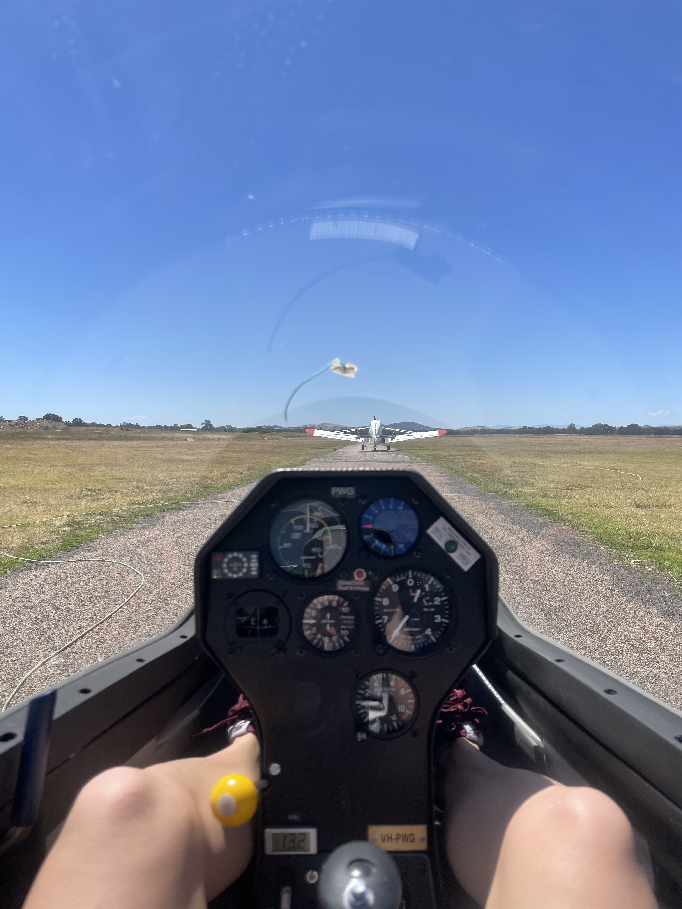
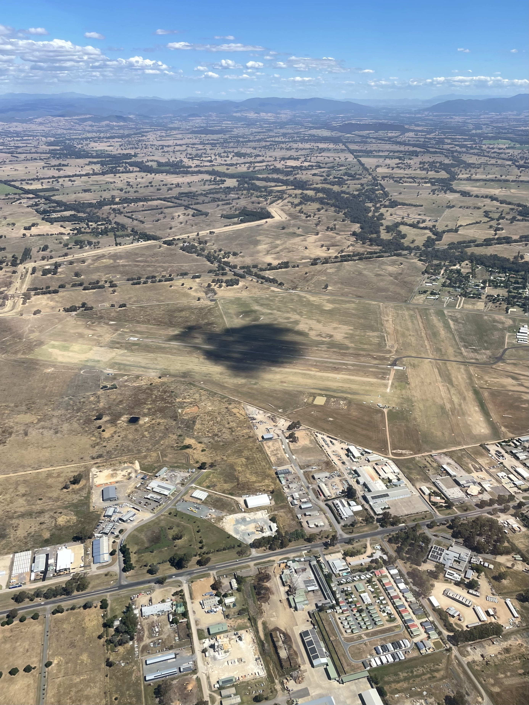
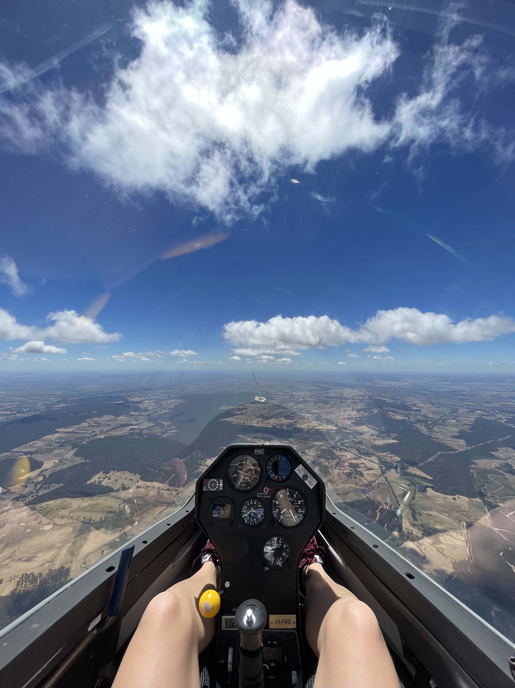
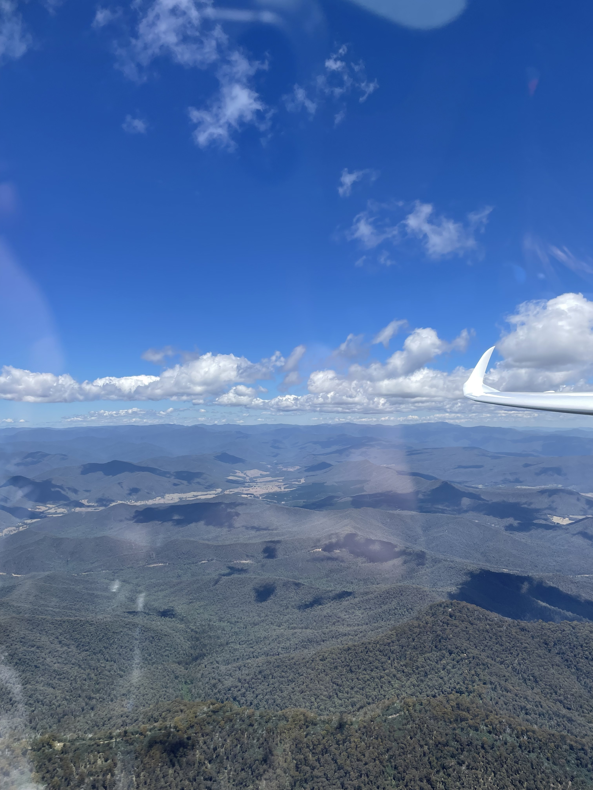
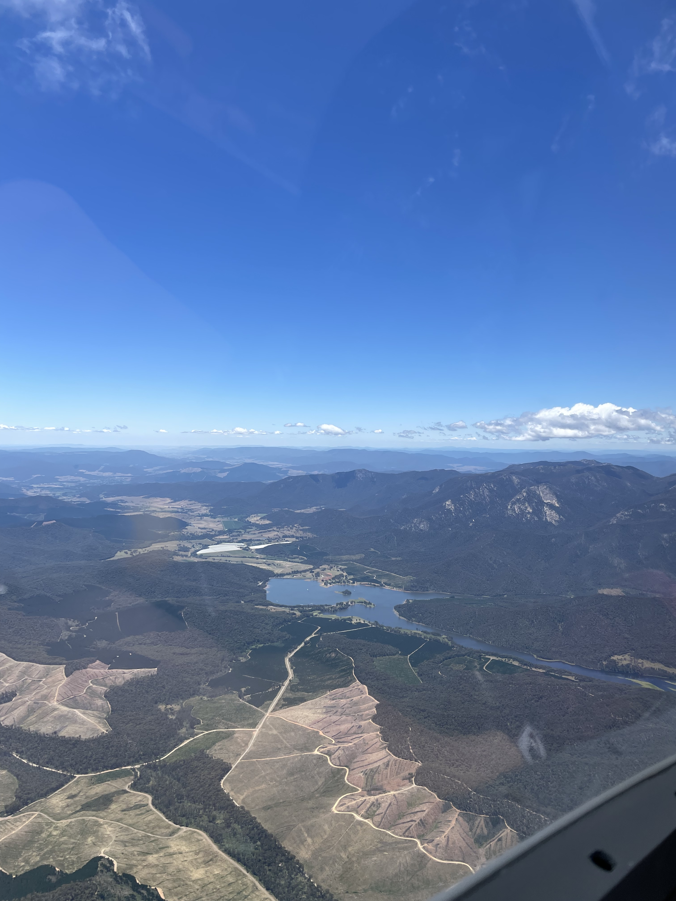
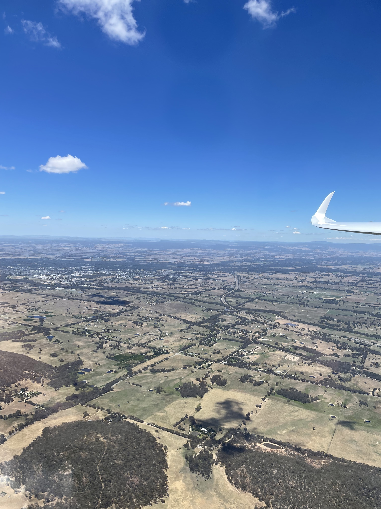
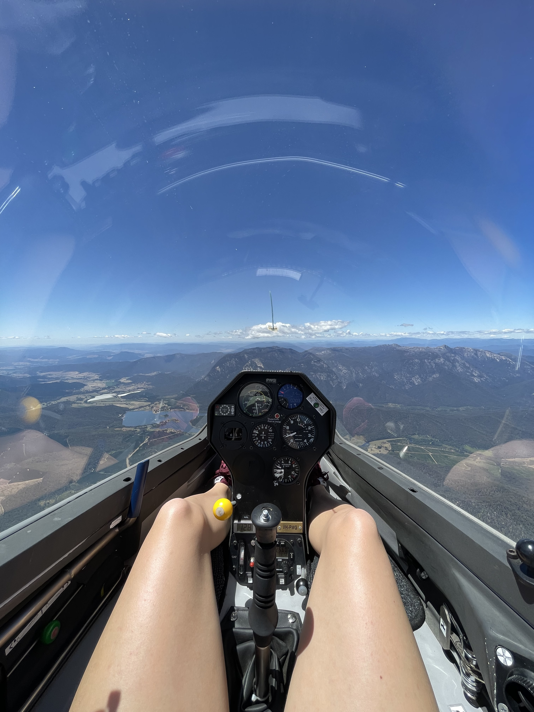
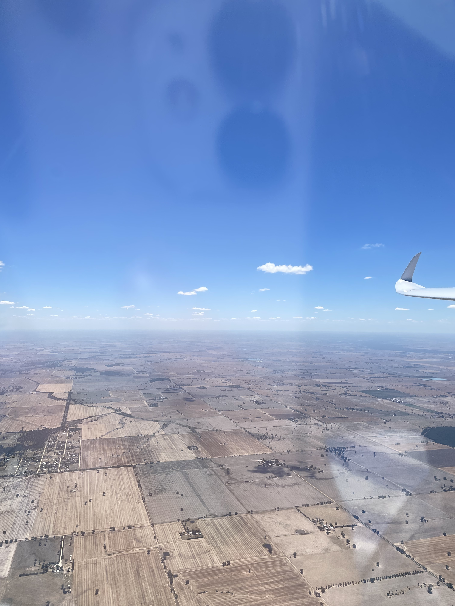
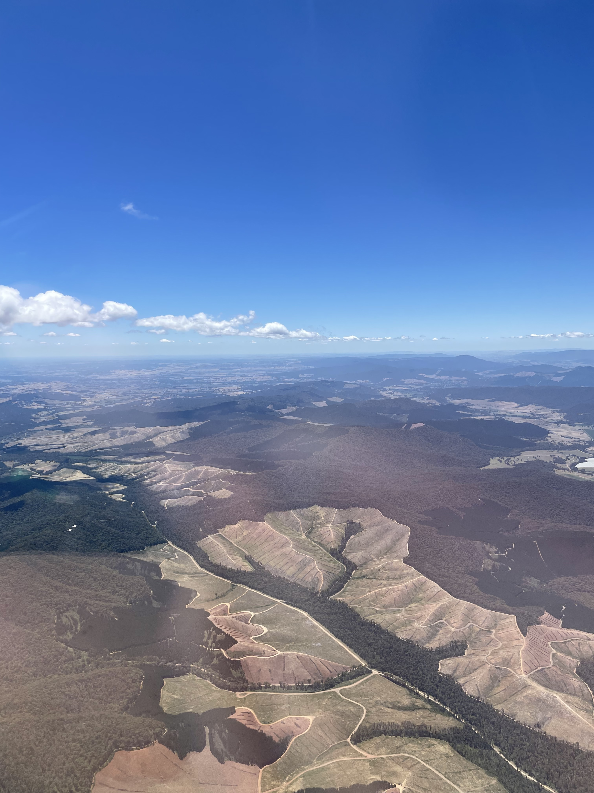

## Segelfliegen in Benalla, AUS

Im Januar 2023 war ich (Elena Steinhorst) 4 Wochen in Australien. Dort habe ich die Chance ergriffen und war vom 06.01.2023-08.01.2023 auf dem Flugplatz Benalla in Victoria. Unser ehemaliges Mitglied Tobias Geiger, sowie alle Pilotinnen und Piloten aus Benalla haben mich dort herzlich empfangen.

Mit Tobi hatte ich auch die einmalige Gelegenheit in Australien zu fliegen. Am Samstag sind wir in der DG1000 von einer Pawnee im Tiefschlepp in die Luft gebracht worden. Ein ganz komisches Gefühl, wenn man Tiefschlepp nicht gewohnt ist. Die Bäume sind gefühlt sehr viel näher vorbeigezogen als ich gewohnt bin. Am Anfang mussten wir echt kämpfen bis die Thermik endlich ordentlich gezündet hat und ich mich an die ganzen „feets“ und „knots“ auf den Instrumenten gewöhnt habe. Von da an lief es echt gut und wir hatten einen wunderschönen Sightseeingflug über 319km. Ich konnte sowohl die bergige Landschaft im Süden, Südosten Benallas als auch die flache Gegend in Richtung Landesinneres bestaunen. Einfach ein unglaublicher Start in die Flugsaison 2023. Vielen Dank an alle in Benalla, die diese Erfahrung möglich gemacht haben!

Ich empfehle jedem, der Mal in Australien ist einen Segelflug zu machen. Es lohnt sich definitiv.

------------------------------------------------------------------------

