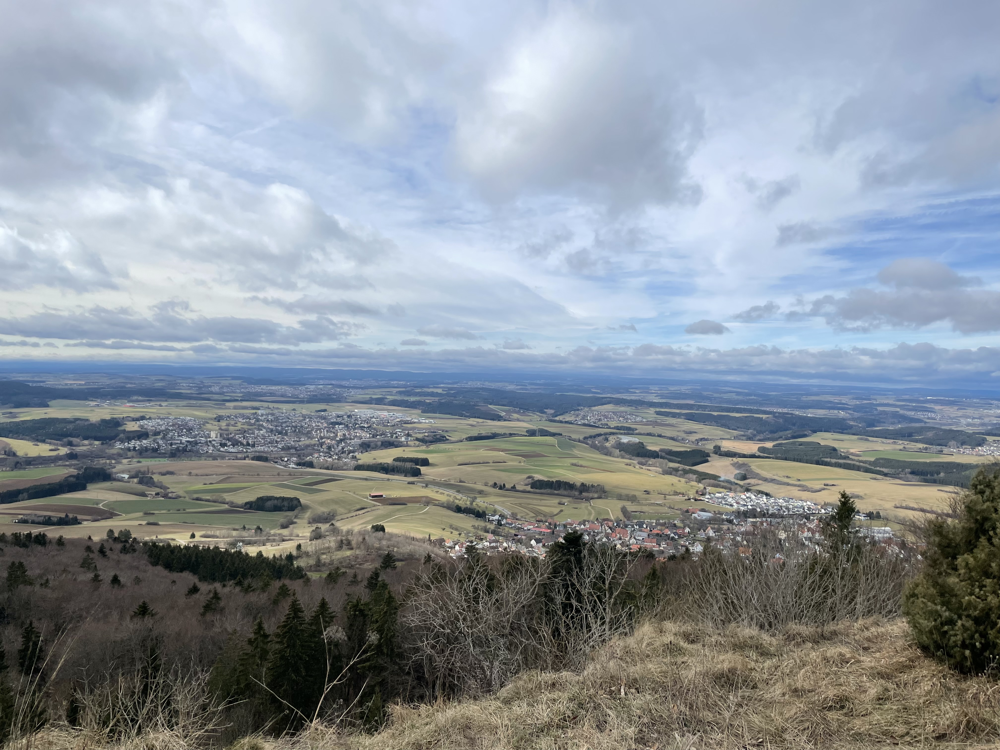
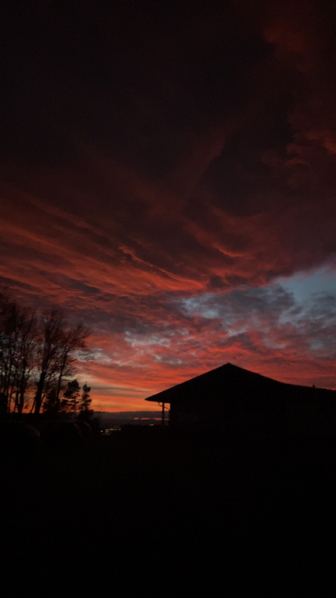
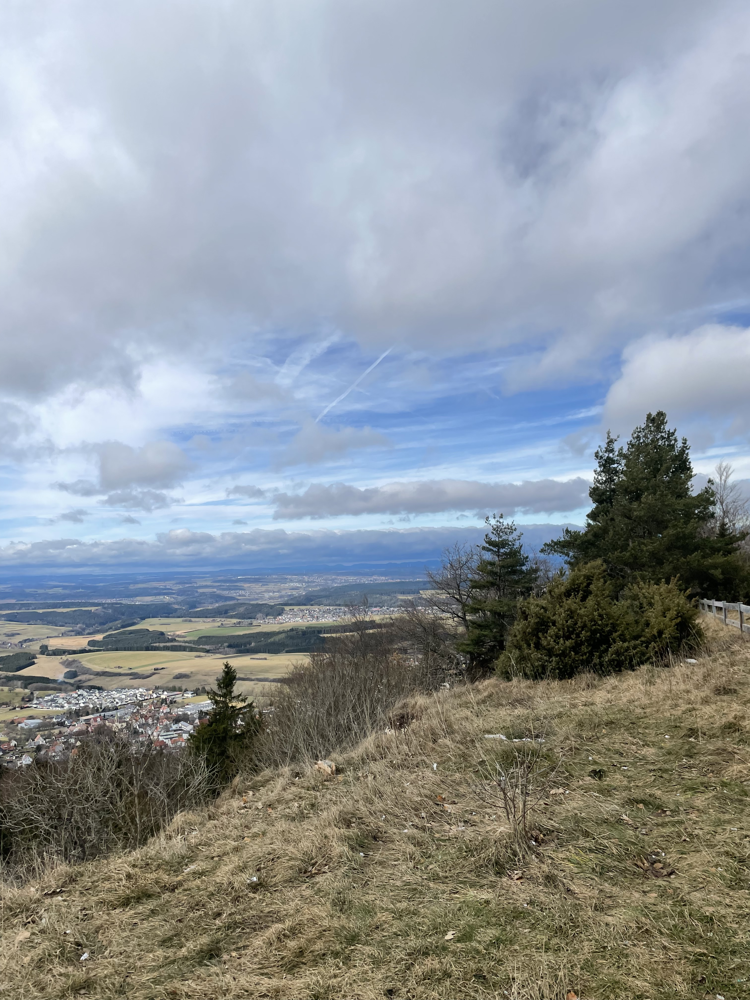

20 Teilnehmer und natürlich 2 Seminarleiter haben sich am Freitag, den 17.02.23 auf dem Klippeneck eingefunden. Alle sind angereist um zusammen am BWLV Streckenflug-Theorie-Seminar teilzunehmen. Dabei waren alle Ecken Baden-Württembergs vertreten. Darunter Bolhof, Friedrichshafen, Isny und mittendrin natürlich unsere Pilotinnen: Amelie und Elena Steinhorst aus Poltringen. Alle wollten sich übers Wochenende dem Seminar stellen um voller Erwartung vieles Neues für die Saison 2023 zu lernen.

**Mit hohen Erwartungen hinein und mit hoher Zufriendenheit hinaus.**

Charlie und Basti Bauder haben es geschafft in ein Wochenende alles zu packen, was man über das Streckenfliegen wissen muss. Das Seminar triefte vor wichtigen Informationen, sodass jede Sekunde ihrer Aufmerksamkeit würdig war. Auch die Notizblöcke füllten sich stetig. Charlie und Basti haben die Teilnehmer gezielt und ohne langes Rumreden durch die Berge an Informationen geführt. Vorbei an Themen wie Außenlandungen, Vorflug, Streckenflugplanung und Training. Natürlich hatten Basti und Charlie zu jedem Thema ein Beispiel aus ihrer eigenen Erfahrung. Selbst beim Thema „Pinkeln im Flugzeug“ wurde kein Halt gemacht, sondern einfach fröhlich drauf los erzählt.

Doch nicht nicht nur die Aktivitäten im Seminarraum waren interessant und spaßig, auch die außerhalb. So wurde am ersten Abend der Tischkicker ordentlich eingeheizt, die ersten Annäherungen zu den anderen Teilnehmern fanden statt und es bildeten sich die ersten Freundschaften.

Am Samstagabend gab es dann eine kleine „Nachtwanderung“ zur Gaststätte „Dreifaltigkeitsberg“, wo alle ein leckeres Abendessen genießen konnten und man kann sagen: hier war die Hemmschwelle nun endgültig gefallen. Während die Frauen über das easy peesy redeten, nippten die Männer an ihren Getränken und schauten sich verstohlen um.

Nachdem sich dann Sonntags noch durch den letzten Endspurt in Sachen Streckenfluplanung gekämpft wurde, ging es für die Teilnehmer dann gegen 15 Uhr wieder zurück in die Heimat.

Gut gestärkt und vollgepumpt mit Informationen starten unsere Mädels nun in die Saison 2023.

Durch das Seminar sind beide nun voller Tatendrang für die Saison 2023 und wollen sich für das BWLV Streckenfluglager und den Wettbewerb auf dem Klippeneck anmelden. Danke dafür an Charlie und Basti Bauder.

Text von Amelie Steinhorst

