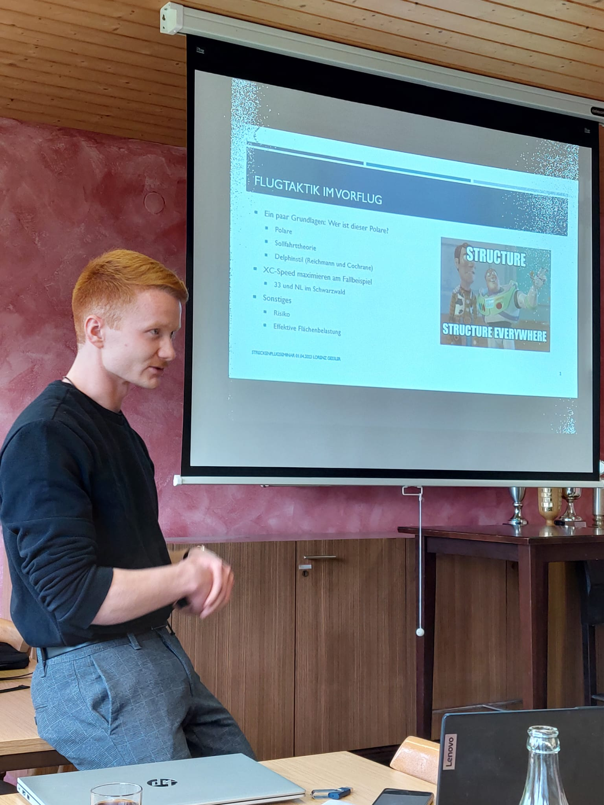

Am 1. April ging unser Ammerbucher Streckenflugseminar in die erste Runde.

Die Ammerbucher Jugendleitung machte es sich dieses Jahr zur Aufgabe ein Seminar anzubieten, welches Piloten weitreichendes Wissen über das Überlandfliegen vermittelt. Passend zum Saisonbeginn. Dafür haben vier Hauptredner\*innen Themen erarbeitet, welche für den Streckenflug relevant sind.

Los ging es um 9 Uhr. Zu Gast: Flugschüler, Jungscheininhaber, Langzeitscheininhaber und das nicht nur aus Poltringen, sondern auch vom Wächtersberg und aus Eutingen. Die Freude über die 13 Teilnehmer war riesig, da wir so viele Teilnehmer definitiv nicht erwartet haben und somit stieg auch die Aufregung der Referenten ein wenig.

Pünktlich startete dann die Unterjesinger Jugendleiterin Elena mit ihrem Thema „Flugvorbereitung“. In ihrem Vortrag ging es darum, welche Ausrüstung wichtig ist und wie man seinen Flug im Vorhinein optimal vorbereiten kann. So konnte man sich einen Blick darüber verschaffen, was eine gute Vorbereitung wirklich bedeutet und, dass es doch deutlich mehr ist als nur einen Snack auf Lager zu haben.

Auf Elena folgte der Herrenberger Jugendleiter Kevin. Er rief uns allen noch einmal das Thema „Luftraum“ und dessen wichtigste Regeln ins Gedächtnis. Kevin bewies sich darin, auch die schwersten Fragen beantworten zu können und zeigte wie ein, als langweilig abgestempeltes Thema, doch spannend sein kann.

Auf seinen Vortrag folgte Henry Blum mit seiner Präsentation über das „Thermik finden“. Er erklärte den Teilnehmern wie Thermik entsteht und wo sie zu finden ist. Dafür packte er allerlei Grafiken aus, sodass man sich eine deutlich bessere bildliche Vorstellung von seinem Thema machen konnte.

Das Schlusslicht bildete Lorenz mit dem Thema „Vorflug“. Lorenz beschrieb verschiedene Flugtaktiken beispielsweise die Delfin-Taktik. Zur Verdeutlichung der jeweiligen Auswirkungen verglich er verschiedene Flüge. Das zeigte, dass schon kleine Geschwindigkeitsunterschiede über Zeit große Auswirkungen habe. Zudem gab er einige Tipps wie man seinen eigenen Flugstil verbessern kann um in Zukunft bessere Schnitte zu erzielen.

Insgesamt waren wir sehr glücklich über das das Seminar. Insbesondere die vielen Fragen und dadurch entstehenden Diskussionen waren sehr informativ. Jeder, egal ob Flugschüler oder Streckenflieger, konnte etwas lernen oder vorhandenes Wissen auffrischen. Nächstes Jahr möchten das Seminar mit Themen ausweiten und noch weitere Vereine einladen.

