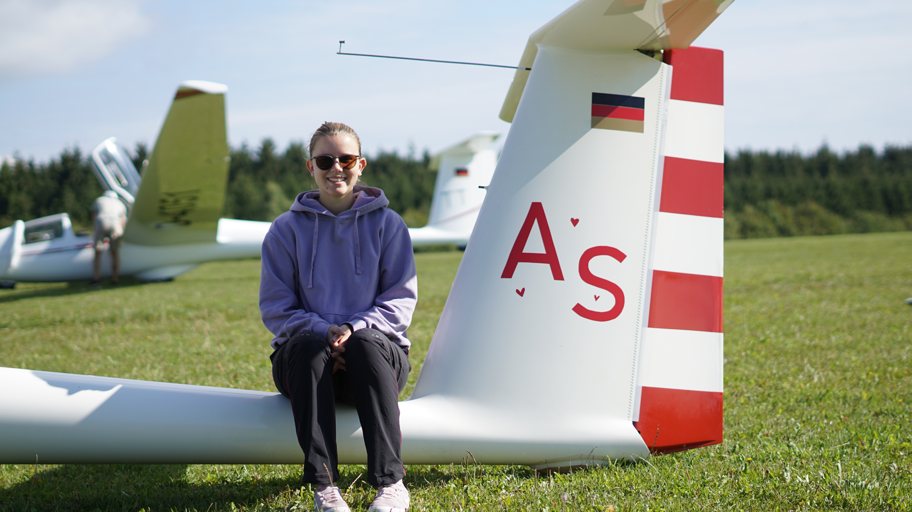
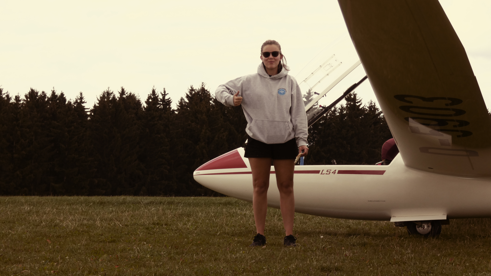
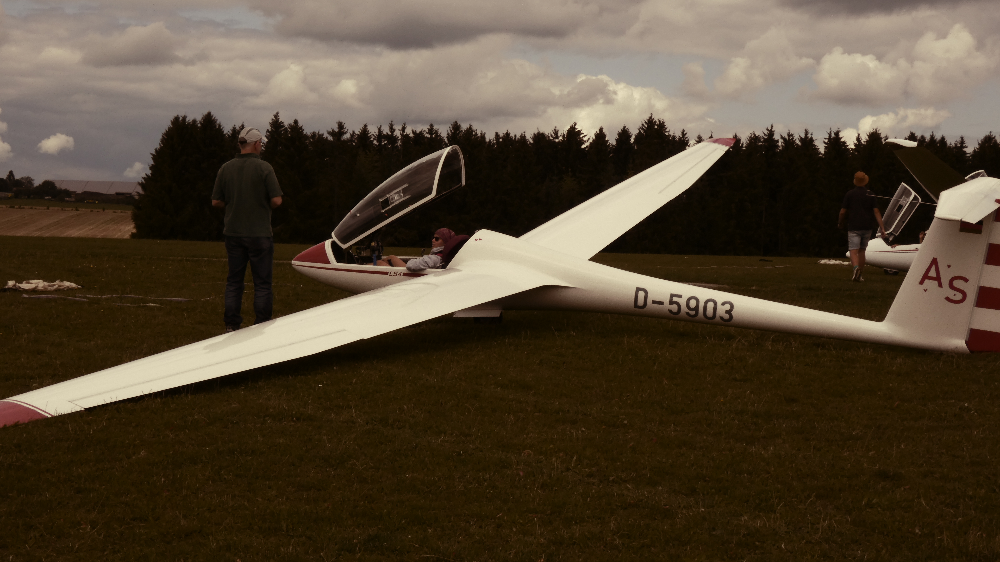
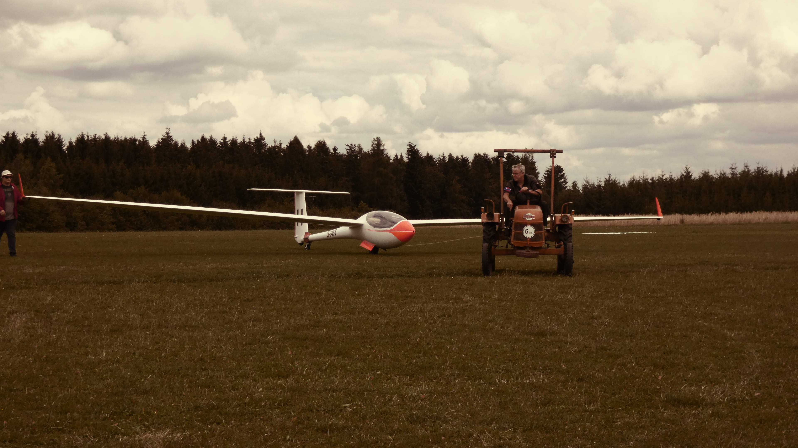
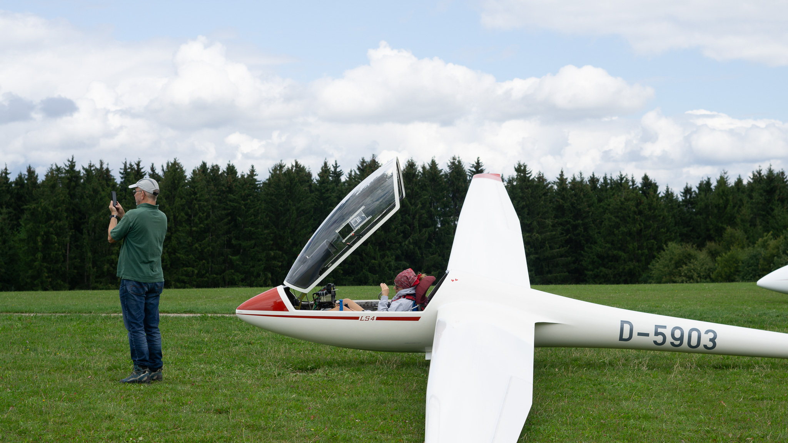

Dieses Jahr vom 5. bis zum 12. August fand das 53. Leibertinger Jugendvergleichsfliegen statt. Mit dabei war ich mit der LS 4, und außerdem acht weitere Flugzeuge mit Piloten. (Ein Segelflugwettbewerb dauert in der Regel eine Woche.)

Aufgrund des Wetters konnte leider nur an fünf der acht Wettbewerbstage geflogen werden, und nur drei Tage wurden gewertet. Trotzdem hatten wir alle großen Spaß, sowohl in der Luft als auch am Boden. (Kann nicht geflogen werden, unternehmen die Teilnehmer und Helfer gemeinsam etwas, z. B. einen Besuch in der Therme oder beim Minigolf.)

Schon vor dem Wettbewerb muss viel organisiert werden. Das Flugzeug muss intakt sein, der Hänger muss TÜV haben, und alles, was es an Ausrüstung gibt, muss zusammengetragen werden. Ist dies erledigt, kann es losgehen. Die Anfahrt aus Poltringen dauerte glücklicherweise nur etwa 1:30h, somit hatten mein Vater (der netterweise als Helfer mitgekommen ist) und ich viel Zeit, um noch den letzten Rest zu verladen, und uns dann ohne Hektik auf den Weg zu machen.

Dort angekommen, habe ich schon die ersten Bekanntschaften gemacht. Es gab auch viele bekannte Gesichter von früheren Veranstaltungen.

Direkt am ersten Tag (5. August) wurde neutralisiert, was auch besser für mich war, denn ich konnte keine Thermik finden. Trotzdem hat es großen Spaß gemacht, denn obwohl ich die Hoffnung in mich schon verloren hatte und total enttäuscht war, hat die ganze Mannschaft am Boden mich weiter motiviert und weiter an mich geglaubt.

Am zweiten Tag (6. August) konnten wir leider überhaupt nicht fliegen, weshalb wir uns direkt dazu entschieden, ins BadKap nach Albstadt zu fahren, und dort die Rutschen unsicher zu machen. Auch das Kinderprogramm hat uns allen großen Spaß bereitet.

Der dritte Tag (7. August) sah, was das Wetter anbelangte, vielversprechender aus. Somit gab es hier die erste Aufgabe für uns. (An Wertungstagen bekommen die Piloten sog. Aufgaben. Das ist ein Zettel, auf dem draufsteht, wo sie hinfliegen sollen). Nachdem einige gestartet sind, wurde diese Aufgabe jedoch abgebrochen und wir durften Spaßfliegen.

Der vierte Tag (8. August) brach an. Es schien vielversprechend. Als Anita ihr obligatorisches „Früüüüüühstüüüück“ vom Balkon rief, wussten alle: heute wird DER Tag. Vesper richten, Zähne putzen, aufbauen und starten. 196 Kilometer sollten wir fliegen und jeder hatte das Ziel am schnellsten zu sein. Direkt hinter der Abfluglinie konnte ich zusammen mit Daniel Krohmer unter den Wolken entlang schießen. Bis zum ersten Wendepunkt, wo ich ihn dann leider verlor und dank schlechten GPS-Signalen einen riesigen Umweg flog. Doch trotz Umweg versuchte ich nicht die Hoffnung zu verlieren und zusammen mit meiner LS4 zu zeigen, was wir können. Belohnt wurden wir mit einer Durchschnittsgeschwindigkeit von 72 km/h und dem vierten Platz. Fantastisch!

Der Mittwoch (9. August) war wetterbedingt wieder ein entspannter Tag am Boden, an dem wir uns als Teilnehmer beim Adventure Golf nochmal besser kennenlernen konnten. Da am Tag davor schon klar war, dass nicht geflogen werden würde, wurde die Nacht lang.

Mein persönliches Highlight war Tag sechs (10. August). Einer der spannendsten Flüge meines Lebens, bei dem unglaubliches Durchhaltevermögen bewies. Ein von Höhen und Tiefen geprägter Flug … wortwörtlich. Sechs Stunden und 10 Minuten pure Anspannung. Der Tag fing gut an, als Sara und ich am Start zu [Kika-Tanzalarm](https://www.youtube.com/watch?v=xw0dS9022aE) getanzt haben. Noch besser wurde es dann in der Luft. Es fing an mit einem schönen Abflug Richtung Albstadt-Degerfeld, zwar mit Schlenker, aber dafür durch wunderschöne Wolken. Doch dann bin ich kurz hinter Albstadt das erste Mal richtig tief gekommen. 250 Meter über dem Boden war ich gar nicht mehr so glücklich, und bereute die Entscheidung den direkten Weg durch das Blaue genommen zu haben statt des Umwegs, der aber schöne Wolken gehabt hätte. Mit viel Vertrauen in mein Flugzeug und großen Hoffnungen grub ich mich schlussendlich aus. Doch bald war die hart erkämpfte Höhe schon wieder weg, und ich musste bei Magoldsheim wieder um jeden Meter kämpfen. Es half alles nichts, und mit noch 192 Metern über Grund ging ich schließlich in den Gegenanflug auf einen Acker. Mit verlorener Hoffnung teilte ich den anderen Piloten über Funk mit, dass ich landen würde, und wünschte ihnen noch einen schönen Flug. Doch dann spüre ich, wie sich mein rechter Flügel hebt, mein Blick schießt zum Variometer, und tatsächlich zeige es mir eine Steigrate von 2,5 m/s an! Also schnell einkreisen! Voller Freude kurbelte ich mich erst auf 470 Meter AGL, dann auf 1.300 AGL, und war somit wieder im Rennen.

Bis Blaubeuren lief wieder alles gut, doch nach fünf Stunden und zwei Beinahe-Außenlandungen war ich sehr erschöpft. Kurz kam der Gedanke einfach in Blaubeuren zu landen, damit es endlich vorbei ist, aber mein kämpferisches Ich sagte mir „Das ist ein Wettbewerb, kein Spaßfliegen! Du willst hier gewinnen! Hier wird nicht gelandet, nur weil du keine Lust mehr hast!“, und so kämpfte ich mich noch ein allerletztes Mal aus der Tiefe hinaus. Während die Anderen landeten oder die Aufgabe schon abgebrochen hatten, flog ich tapfer immer weiter. Planmäßig wollte ich in Riedlingen landen, da es nun wolkenlos war, und keine Thermik mehre zu spüren war. Da ich Riedlingen aber einfach nicht gesehen habe (vermutlich zu weit in die Ferne geguckt, obwohl ich quasi drüber war) bin ich daraufhin einfach weitergeflogen, anstatt ewig zu suchen. Diese Entscheidung gab mir ein paar zusätzliche Kilometer Strecke, die mich letztendlich zum Tagessieger machten!

Und nun zum siebten und letzten Tag (11. August). 129 Kilometer, die einfach nicht am Schnürchen laufen wollten, aber dennoch hatte ich einen tollen Flug zusammen mit der ASK 21 „TT“, die ich einfach nicht abschütteln konnte.

Schlussendlich ergatterte ich den 5. Platz, und konnte in dieser Woche sehr viele hilfreiche Erfahrungen sammeln.

Danke an meinen Vater, der immer zur Stelle war, mich immer motiviert hat, und immer Ruhe bewahrt hat. Danke auch an meine Schwester, die mir ab und zu Infos und Tipps von zu Hause aus durchgegeben hat, und danke an meine Mama, die sowieso nie an mir zweifelt, und natürlich danke an das Team aus Leibertingen fürs Organisieren und Unterstützen!

