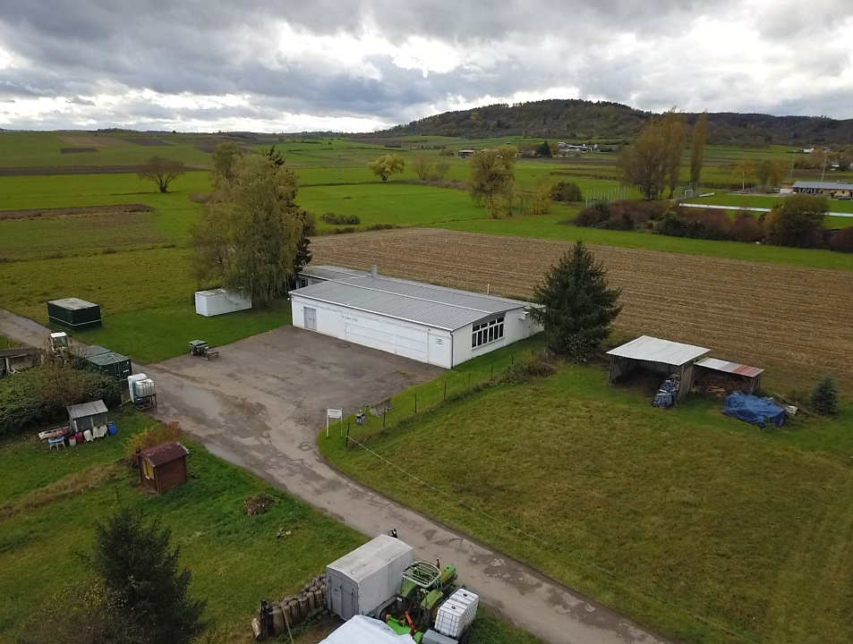

{{< poi-map zoom="12" points=`[{"lat":48.52270,"lon":8.97833}]` >}}

Das Vereinsheim des FSV Unterjesingen liegt am Ortsausgang Unterjesingen Richtung Wurmlingen, in der Rottenburgerstraße 54.
Es ist sowohl mit der Ammertalbahn über die Haltestelle Unterjesingen Sandäcker als auch mit dem Auto gut zu erreichen.

Das in den 1950er Jahren errichtete Gebäude diente bis 1972 als Flugzeughalle für den ehemaligen Flugplatz Unterjesingen.

Seit dem Umzug nach Poltrigen nutzt der Flugsportverein Unterjesingen das Gebäude für die Wartung und Unterstellung der Flugzeuge im Winter. Du findest uns hier jeden (bis auf Feiertage) Dienstag und Freitag von 18:30 - 21:30 Uhr ab Mitte November bis Mitte März. Ebenfalls halten wir hier unsere Ausschusssitzungen, einen Teil der Theorie und das ein oder andere Fest ab.

